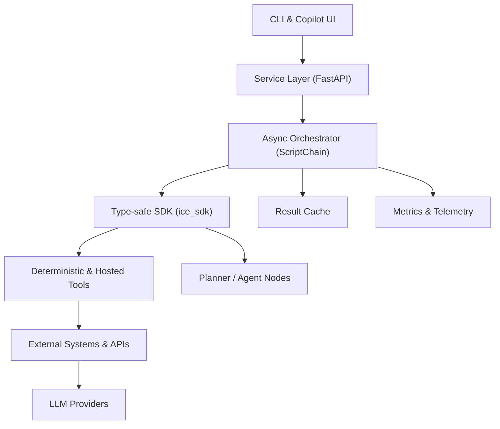

# iceOS – Intelligent Composable Environment

> *The AI-native operating layer for building agentic, event-driven applications.*
> **iceOS solves the complexity of safely orchestrating multi-agent AI workflows for developers and product teams.**

[](https://github.com/stef-writes/iceOSv1-A-/actions/workflows/ci.yml)

---

## 1  Typical README

### 1.1 Overview

**iceOS** is an Apache-2 licensed orchestration platform that combines a type-safe SDK, an async workflow engine, and a service layer to let developers *clone → scaffold → run* an AI workflow in minutes. Its modular node architecture supports LLM calls, deterministic tools, branching conditions and multi-step agents, all executed as a level-parallel DAG with built-in guardrails.

#### Architecture Diagram



### 1.2 Quick Start

```bash
# Clone & enter repo
$ git clone https://github.com/stef-writes/iceOSv1-A-.git && cd iceOSv1-A-

# Create virtual-env and install deps
$ python -m venv .venv && source .venv/bin/activate
$ pip install -e .[dev]

# Run the test-suite (≈2 s)
$ make test
```

### 1.3 Common Tasks

| Task                | Command                            |
| ------------------- | ---------------------------------- |
| Lint & type-check   | `make lint`                        |
| Remove artefacts    | `make clean`                       |
| Generate docs       | `make refresh-docs`                |
| Run a workflow demo | `python scripts/demo_run_chain.py` |

### 1.4 Further Reading
- *Archived design documents and changelogs live in* `docs/archive/` *for historical reference.*

### 1.5 Security

`ice_sdk.tools.mcp` supports optional Fernet-encrypted transport. Supply a 32-byte URL-safe base64 key via `encryption_key`:

```python
server = MCPServerStdio({
    "command": "myserver",
    "args": ["--stdio"],
    "encryption_key": os.environ["MCP_FERNET_KEY"],
})
```

If `cryptography` is missing the call quietly falls back to plaintext; install the optional extra to enforce encryption:

```bash
pip install cryptography
```

---

## 2  Roadmap (Agile Delivery)

*Last reviewed: **June 24 2025***

### 2.1 Guiding Principles

1. Ship usable increments weekly (`0.2.x` patch releases).
2. Optimise **developer ergonomics** over raw feature breadth.
3. Freeze the public SDK API after `v0.2`; breaking changes require a minor version bump.

### 2.2 Immediate Next Steps (Days 1-14)

| ETA     | Milestone                         | Key Deliverables                                                                                                                                          |
| ------- | --------------------------------- | --------------------------------------------------------------------------------------------------------------------------------------------------------- |
| Day 1   | **v0.2 Minimal-Viable Release**   | Safe-mode guard, PyPI wheel, example chain, 3-line FastAPI snippet                                                                                        |
| Day 3   | **Developer Loop Polish**         | `ice` CLI (`new tool`, `run --watch`), auto-registration, 5-min walkthrough docs                                                                          |
| Day 4   | **Public API Freeze & Packaging** | Frozen exports, contract tests, generated API docs, optional extras, manylinux wheel                                                                      |
| Day 5   | **Reusable Examples Library**     | File summariser, GitHub issue triager, deterministic data-pipeline demos                                                                                  |
| Day 6   | **Pluggable Node Ecosystem**      | Test harness, entry-point discovery, `ice sdk create-node`, `/nodespecs` API                                                                              |
| Day 10  | **Core Node Catalogue v1**        | Ingress (Webhook, Slack), Pre-process (HTML cleaner, SQL fetch), LLM (OpenAI, DeepSeek, Anthropic, Gemini), Post-process (Validator), Sink (Slack, Email) |
| Day 14  | **Frosty UI & Marketplace Alpha** | React-Flow canvas powered by `/nodespecs`, JSON round-trip, drag-and-drop node install                                                                    |
| Ongoing | **Community Feedback Loop**       | Discussions board, Slack, "good first issue" labels, weekly DX-focused patch releases                                                                     |

### 2.3 Key Developments & Milestones (Q3 2025)

| Week | Focus                  | Outcome                                         |
| ---- | ---------------------- | ----------------------------------------------- |
| 1    | v0.2 minimal release   | Safe-mode guard, PyPI wheel, example chain      |
| 2    | Developer CLI          | `ice new`, `ice run --watch`, auto-registration |
| 3    | API freeze & packaging | Stable SDK exports, docs, extras                |
| 4    | Examples & community   | Workflow recipes, community channels            |

---

## 3  Vision (12-Month Outlook)

1. **Frosty Copilot** – a natural-language canvas that generates, explains and refactors workflows.
2. **Guard-railed Runtime** – depth, token & semantic limits with pluggable policy hooks.
3. **Extensible Ecosystem** – verified tool marketplace, shareable workflow library, versioned `IceWorkflowSpec`.
4. **Self-Improving Engine** – telemetry-driven optimisers that rewrite DAGs for latency, cost and accuracy.

### Long-Term Milestones

| Horizon | Milestone                        | Description                                                        |
| ------- | -------------------------------- | ------------------------------------------------------------------ |
| 6 mo    | **Copilot GA**                   | WYSIWYG canvas with NL authoring, live Verifier feedback           |
| 9 mo    | **Marketplace v1**               | Verified node registry, revenue-share model, auto-update mechanism |
| 12 mo   | **Self-Optimising Orchestrator** | Runtime telemetry loop that predicts & applies optimal plans       |

---

## 4  Competitive Landscape (June 2025)

| Dimension          | Workflow86                              | LangGraph              | n8n (+AI ext.)       | **iceOS (0.2-alpha)**              |
| ------------------ | --------------------------------------- | ---------------------- | -------------------- | ---------------------------------- |
| Licence / deploy   | Closed-source SaaS                      | MIT, library           | AGPL core + cloud    | **Apache-2 OSS**                   |
| Primary UX         | Chat → visual canvas                    | Code (Python/TS)       | Visual canvas + chat | Code (Pydantic)                    |
| Text→flow maturity | GA (describe/upload)                    | DIY                    | GA via extension     | **Planned "Frosty Copilot"**       |
| Target workflows   | Business ops & forms                    | Multi-agent LLM graphs | API/data automations | Agentic + event-driven AI          |
| Guard-rails        | Version-controlled runs, human approval | Build your own         | Basic retries        | Depth/token/semantic hooks         |
| Extensibility      | JS/Python code node                     | Any Python callable    | 400+ nodes           | Python tools; entry-point auto-reg |

iceOS differentiates on **deep guardrails**, an **async level-parallel engine**, and a **type-safe SDK** that enforces contracts at import-time.

---

## 5  Moats

1. **Orchestration Complexity** – Level-parallel execution with deterministic caching and failure-policy controls makes reproducing the engine non-trivial.
2. **Layered Guardrails** – Depth, token & semantic limits with pluggable policies address enterprise governance requirements beyond retries or rate-limits.
3. **Ecosystem Lock-in** – Versioned `IceWorkflowSpec`, verified node marketplace and auto-discovery create network effects around contributed nodes.
4. **Data Network Effects** – Telemetry from thousands of workflows trains the self-optimising planner and verifier, compounding performance advantages.
5. **Type-Safety & Contract Tests** – Strict Pyright enforcement and import-linter contracts preserve internal velocity while assuring external stability.

---

> **Maintainers:** Update section 2 (Roadmap) after each sprint and refresh competitive data when a material market event occurs.

---

## 6  Front-End Vision & User Experience

### 6.1 Design Goals
1. **Instant feedback** — every canvas action produces a runnable diff within seconds.
2. **Explainability** — hover reveals node provenance, context, and cost telemetry.
3. **Multiplayer by default** — Yjs-backed CRDT sessions enable pairing and live review.

### 6.2 Primary Personas
| Persona | Needs | Key UX Hooks |
|---------|-------|--------------|
| **AI Engineer** | Low-friction authoring; inspect JSON; CLI integration | Hot-reloading, schema lens |
| **Ops Analyst** | Visualise data flows; schedule & monitor runs | Guardrail dashboard, run history |
| **Product PM** | Ideate features without code; share prototypes | Natural-language Copilot, templated blueprints |

### 6.3 Core Interaction Modes

The forthcoming **infinite canvas UI** unlocks three complementary user paths that bridge brainstorming, visual composition and executable workflows:

1. **Drag-and-Drop Composition** — place nodes and reusable components onto the canvas, draw edges, and configure properties in a contextual side-panel. A low-code path for quickly wiring data sources, LLM steps and sinks.
2. **Ideation Copilot** — supply a free-form prompt and receive a structured mind-map or draft workflow. Inspired by Miro-style AI but tuned for complex, multi-stage problem-solving that can be promoted directly into runnable graphs.
3. **Frosty Mode** — conversational commands that generate or edit live systems:

   * *"Create a weekly research-digest agent that summarises PDFs in this folder."*
   * *"Swap the OpenAI node for Gemini 1.5 and keep the same output schema."*
   * *"Add a semantic guardrail rejecting PII."*

Canvas documents are stored as versioned `IceCanvasSpec` JSON, round-trip cleanly with the backend DAG and support multiplayer editing via CRDTs. This guarantees that anything you sketch can be executed, re-loaded and evolved without loss of fidelity.

## 7  Current Capabilities (v0.x)

| Layer | Implemented Highlights |
|-------|------------------------|
| **FastAPI Application** (`src/app`) | • Root health-check `/` • V1 API endpoints for executing a single node or a full chain |
| **Orchestration Engine** (`ice_orchestrator`) | • Async `ScriptChain` executes `AiNode` & `ToolNode` DAGs • Basic dependency graph |
| **Core SDK** (`ice_sdk`) | • Pydantic node / tool configs • `AgentNode` wrapper for LLM calls • `LLMService` with OpenAI, Anthropic, Gemini & DeepSeek handlers • `GraphContextManager` • **New** `ice_sdk.interfaces` module that exposes lightweight `Protocol`s so inner layers never import outer ones |
| **Tools** (`ice_sdk.tools`) | • `BaseTool` abstraction • Hosted: `WebSearchTool`, `FileSearchTool`, `ComputerTool` • Deterministic: `SleepTool`, `HttpRequestTool`, `SumTool` |
| **Quality Tooling** | • Ruff & isort • Black • MyPy (strict) • Pyright • Import-linter contracts • Pre-commit auto-format • Unit & integration tests (coverage ≥56 %) |

---

## 8  Node Types & Execution Logic Snapshot (v0.2)

| Node Type | Purpose | Key Executor / Class | Notes |
|-----------|---------|----------------------|-------|
| `ai` | LLM-powered step that consumes context and produces text/JSON | `ice_sdk.executors.ai_executor`, `BaseLLMHandler` | Providers: OpenAI, DeepSeek, Anthropic, Gemini. DRY helpers handle usage + function-call formatting. |
| `tool` | Deterministic side-effectful action (HTTP call, file IO, etc.) | `ice_sdk.executors.tool_executor` | External effects isolated to `Tool` impls; pure Pydantic config. |
| `condition` | Branching based on boolean expression | `ice_sdk.executors.condition_executor` | Guards downstream nodes; expression evaluated in sandbox. |
| `agent` | Multi-tool reasoning loop (Plan→Act→Observe) | `ice_sdk.agents.agent_node.AgentNode` | Optional, powered by `ai` under the hood. |

Execution model essentials:
* **DAG & Levels** — `ScriptChain` topologically sorts nodes into *levels* for max parallelism without violating deps.
* **Async all-the-things** — executors are `async def`, cooperatively scheduled via `WeightedSemaphore` to honour `max_parallel`.
* **Node Registry** — `@register_node("ai")` style plug-ins map `NodeConfig.type` → executor at import-time (entry-point discovery in Day 6).
* **Caching & Idempotency** — node result cache key = `hash(context_subset)` + `hash(node_config)`; override with `use_cache: false`.
* **Failure Policy** — chain level (`HALT`, `CONTINUE_POSSIBLE`, `ALWAYS`) controls error propagation.
* **Legacy Boundary** — old paths (`ice_orchestrator.nodes.*`) re-export `ice_sdk` if `ICE_SDK_ENABLE_LEGACY_IMPORTS=1`.

---

## 9  Risks & Mitigations

| Risk | Mitigation |
|------|-----------|
| **LLM Provider Shifts** | Keep `LLMService` adapter pattern; add local-model handler |
| **OSS Competition** | Differentiate via deep guardrails & enterprise governance |
| **Type-Safety Erosion** | "No new Pyright errors" pre-commit hook |
| **Security Debt** | `pip-audit` enforced in CI + OWASP review |
