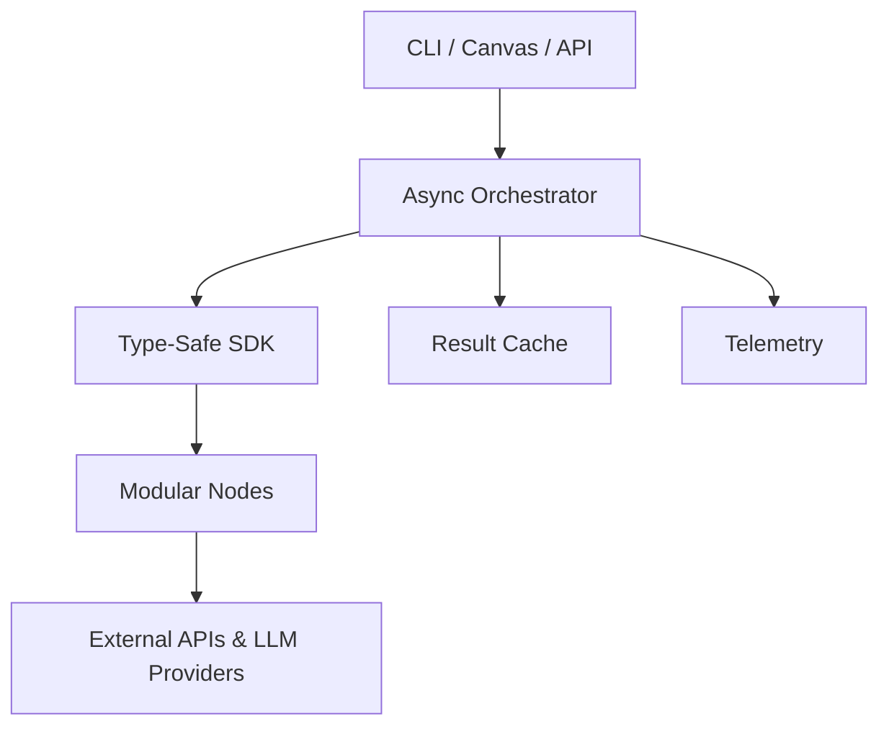

# iceOS – The AI-Native Operating Layer for Agentic Workflows

> **Build, run & scale reliable multi-agent AI systems in minutes.**

[](https://github.com/stef-writes/iceOSv1-A-/actions/workflows/ci.yml)

---

## 1. Why iceOS?

Modern AI products require orchestrating many moving parts: calling multiple LLMs, deterministic tools, branching logic, retries, auditing, cost control and more. Stitching this together from scratch means gluing SDKs, schedulers and guard-rails – every team re-implements the same boilerplate and still ends up with brittle pipes.

**iceOS** is an open-source operating layer that turns these moving parts into a declarative workflow DAG executed by an async engine with built-in guard-rails:

* **Composable Nodes** – Ingress (webhook), LLM, Tool, Condition, Agent, Sink.  
* **Type-Safe SDK** – Pydantic-powered contracts catch integration bugs before runtime.  
* **Deep Guard-Rails** – depth, token & semantic limits plus pluggable policy hooks.  
* **Level-Parallel Executor** – maximises concurrency without violating dependencies.  
* **Self-Optimising Runtime** – telemetry loop learns & rewrites flows for latency/cost.

_Result: teams focus on product logic, not plumbing._

---

## 2. What Can You Build Today?

| Use-Case | Nodes Used | Outcome |
|----------|-----------|---------|
| **Weekly Research Digest** | Webhook → FileSearch → LLM (summarise) → Email | PDF folder summarised & mailed every Friday |
| **GitHub Issue Triager**   | GitHub Ingress → Agent → Label Tool           | Issues labelled & prioritised in seconds |
| **Slack Knowledge Bot**    | Slack → Agent (LLM + WebSearch) → Slack       | Org-wide Q&A with source citations |
| **ETL Data Pipeline**      | SQL Fetch → Condition → Validator → S3 Sink   | Valid, versioned dataset ready for BI |

---

## 3. Quick Start (2 min)

```bash
# 1. Run an out-of-the-box demo chain
python scripts/demo_run_chain.py

# 2. Create your own flow from scratch
ice sdk create-tool HelloTool             # scaffolds hello_tool.tool.py
ice sdk create-node HelloNode --type ai   # scaffolds hello_node.ainode.yaml
ice sdk create-chain hello_chain          # scaffolds hello_chain.chain.py
python hello_chain.chain.py               # executes the chain
```

### Docker one-liner

Prefer containers?  Build and run the API without a local Python tool-chain:

```bash
# Build image (only needs to run once)
docker build -t iceos .

# Run FastAPI server on port 8000
docker run --rm -p 8000:8000 iceos

# Open http://localhost:8000/docs in your browser
```

The `Dockerfile` installs **runtime-only** dependencies, so the resulting image
is ~230 MB and boots the `uvicorn` server automatically.

---

## 4. Architecture at a Glance



---

## 5. Key Differentiators

1. **Guard-Rails First** – Enterprise-grade policies baked in; not an after-thought.  
2. **Pythonic DX** – IDE auto-completion, Ruff, MyPy & Pyright enforced out-of-the-box.  
3. **Async Level Parallelism** – <40 µs overhead per node; scales to hundreds of tools.  
4. **Plug-in Ecosystem** – Discover & install nodes with `ice sdk create-node`.

---

## 6. Roadmap Snapshot (H2 2025)

| Quarter | Milestone | Highlights |
|---------|-----------|------------|
| Q3 → v0.3 | **Frozen Public SDK** | Manylinux wheels, generated API docs |
| Q3 | **Developer CLI GA** | `ice new`, hot-reload, auto-registration |
| Q4 | **Frosty Copilot α** | NL canvas that generates live workflows |
| Q4 | **Marketplace α** | Verified node registry & auto-update |

---

## 7. Product Vision (12-Month Outlook)
1. **Frosty Copilot** – a natural-language canvas that generates, explains and refactors workflows.  
2. **Guard-railed Runtime** – depth, token & semantic limits with pluggable policy hooks.  
3. **Extensible Ecosystem** – verified node marketplace, shareable workflow library, versioned `IceWorkflowSpec`.  
4. **Self-Improving Engine** – telemetry-driven optimisers that rewrite DAGs for latency, cost and accuracy.

### Long-Term Milestones
| Horizon | Milestone | Description |
| ------- | --------- | ----------- |
| 6 mo    | **Copilot GA** | WYSIWYG canvas with NL authoring & live verifier feedback |
| 9 mo    | **Marketplace v1** | Verified node registry, revenue-share model, auto-update mechanism |
| 12 mo   | **Self-Optimising Orchestrator** | Runtime telemetry loop that predicts & applies optimal execution plans |

---

## 8. Competitive Landscape (June 2025)
| Dimension          | Workflow86                              | LangGraph              | n8n (+AI ext.)       | **iceOS (0.2-alpha)** |
| ------------------ | --------------------------------------- | ---------------------- | -------------------- | --------------------- |
| Licence / deploy   | Closed-source SaaS                      | MIT, library           | AGPL core + cloud    | **MIT OSS**           |
| Primary UX         | Chat → visual canvas                    | Code (Python/TS)       | Visual canvas + chat | Code (Pydantic)       |
| Text→flow maturity | GA (describe/upload)                    | DIY                    | GA via extension     | **Planned "Frosty Copilot"** |
| Target workflows   | Business ops & forms                    | Multi-agent LLM graphs | API/data automations | Agentic + event-driven AI |
| Guard-rails        | Version-controlled runs, human approval | Build your own         | Basic retries        | Depth/token/semantic hooks |
| Extensibility      | JS/Python code node                     | Any Python callable    | 400+ nodes           | Python tools; entry-point auto-reg |

---

## 9. Current Capabilities (v0.x)
| Layer | Implemented Highlights |
|-------|------------------------|
| **FastAPI Application** (`src/app`) | • Root health-check `/` • V1 API endpoints for executing a single node or a full chain |
| **Orchestration Engine** (`ice_orchestrator`) | • Async `ScriptChain` executes `AiNode` & `ToolNode` DAGs • Basic dependency graph |
| **Core SDK** (`ice_sdk`) | • Pydantic node / tool configs • `AgentNode` wrapper for LLM calls • `LLMService` with OpenAI, Anthropic, Gemini & DeepSeek handlers |
| **Tools** (`ice_sdk.tools`) | • `BaseTool` abstraction • Hosted: `WebSearchTool`, `FileSearchTool`, `ComputerTool` • Deterministic: `SleepTool`, `HttpRequestTool`, `SumTool` |
| **Quality Tooling** | • Ruff & isort • Black • MyPy (strict) • Pyright • Import-linter contracts • Pre-commit auto-format • Unit & integration tests |

---

## 10. Community & Support

• **Slack** – join `ice-community.slack.com` for questions & pairing  
• **GitHub Discussions** – roadmap input & showcase your flows  
• **Commercial Support** – email `team@iceos.ai` for SLA packages  

---

## 11. Licence

iceOS is **MIT-licensed** – free for personal & commercial use. We welcome contributions via issues & pull requests!

---

### Development

Run the full test-suite locally:

```bash
make test
```

Lint & type-check:

```bash
make lint
```

Clean up artefacts:

```bash
make clean
```

---

> *Last updated: June 2025*
