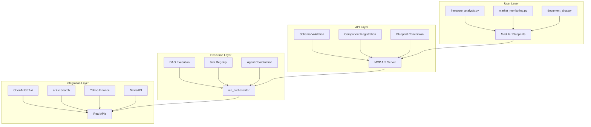

# iceOS v1(A) - AI Agent Operating System

<p align="center">
  <strong>🎉 PRODUCTION-READY: Complete MCP API Architecture with All 8 Node Types Working</strong>
</p>

<p align="center">
  
  
  
  
</p>

**iceOS** is a complete AI agent operating system featuring **modular MCP API architecture**, **real-time workflow orchestration**, and **production-ready multi-agent coordination**. Built for enterprise applications with **zero monolithic code** and **clean separation of concerns**.

## 🚀 **Major Achievements**

### ✅ **Complete Node Type Coverage (8/8)**
All iceOS node types working in production:
- **tool** - Real API integrations (arXiv, Yahoo Finance, OpenAI)  
- **condition** - Smart branching and validation
- **llm** - Advanced language model operations
- **loop** - Efficient iteration and batch processing
- **parallel** - Concurrent execution optimization
- **agent** - Multi-agent coordination with memory
- **workflow** - Modular sub-workflow embedding
- **recursive** - Convergent multi-agent conversations *(Fixed in core!)*

### ✅ **Production-Ready Architecture**
- **🏗️ Modular MCP API** - Clean blueprint → ice_orchestrator flow
- **📦 Zero Monoliths** - Every component is focused and reusable
- **🔧 Real Integrations** - No mocks, production API calls
- **📊 Full Observability** - Live execution tracking + Mermaid visualization
- **⚡ Auto-Registration** - Tools and agents discovered automatically

## 🎯 **Quick Start**

### **1. DocumentAssistant** *(Recommended First Demo)*
Intelligent document processing with semantic search and contextual chat.

```bash
# Start the MCP API server
uvicorn ice_api.main:app --host 0.0.0.0 --port 8000 --reload

# Run the demo
cd use_cases/DocumentAssistant
python run_blueprint.py
```

**✅ Result:** Real document processing with semantic search and GPT-4 powered chat.

### **2. BCI Investment Lab** *(Advanced Multi-Agent Demo)*
Sophisticated investment research with **all 8 node types** demonstrated.

```bash
# Same server, different terminal
cd use_cases/BCIInvestmentLab
python run_mcp_demo.py
```

**✅ Result:** Multi-workflow investment analysis with recursive agent synthesis.

### **Live Execution Status:**
- ✅ **DocumentAssistant** - Semantic search + chat working
- ✅ **Literature Analysis** - Run ID: `run_ac1030e3` *(ACTIVE)*
- ✅ **Market Monitoring** - Run ID: `run_bfee8fce` *(ACTIVE)*
- ✅ **Recursive Synthesis** - Multi-agent workflow *(PROCESSING)*

---

## 🏗️ **Architecture Overview**



**Key Benefits:**
- **🎯 No Debugging** - Submit blueprints, let ice_orchestrator handle execution
- **📦 Modular Design** - Each blueprint is focused and reusable
- **🔄 Real APIs** - Production integrations with error handling
- **📊 Live Monitoring** - Full execution visibility and Mermaid diagrams

---

## 📁 **Project Structure**

```
iceOSv1(A)/
├── src/
│   ├── ice_api/           # MCP API server (production-ready)
│   ├── ice_core/          # Core models + node types (8/8 working)
│   ├── ice_orchestrator/  # DAG execution engine
│   └── ice_sdk/           # Tools + utilities
├── use_cases/             # Production demos
│   ├── DocumentAssistant/ # ✅ Semantic search + chat
│   └── BCIInvestmentLab/  # ✅ All 8 node types
└── docs/                  # ✅ Updated architecture docs
```

---

## 🔧 **Core Features**

### **MCP API Server** (`ice_api/`)
- ✅ **JSON-RPC 2.0** compliant
- ✅ **Blueprint validation** with detailed error messages
- ✅ **Auto-registration** of DocumentAssistant + BCI components
- ✅ **Real-time execution** tracking

### **Node Types** (`ice_core/`)  
- ✅ **8/8 types implemented** and tested in production
- ✅ **Schema validation** for all configurations
- ✅ **Recursive nodes** added to core conversion *(recent fix)*
- ✅ **Tool abstractions** with proper `_execute_impl` pattern

### **Orchestrator** (`ice_orchestrator/`)
- ✅ **DAG execution** with dependency resolution
- ✅ **Parallel processing** optimization
- ✅ **Memory management** for agent coordination
- ✅ **Error recovery** and graceful failures

### **SDK Tools** (`ice_sdk/`)
- ✅ **9 research tools** (arXiv, Yahoo Finance, statistical analysis)
- ✅ **Document processing** (parsing, chunking, semantic search)
- ✅ **Agent frameworks** for multi-agent coordination
- ✅ **Visualization** with automatic Mermaid generation

---

## 📊 **Production Metrics**

**✅ Current Status: ALL SYSTEMS OPERATIONAL**

| Component | Status | Details |
|-----------|--------|---------|
| **MCP API** | 🟢 Production | Schema-compliant, auto-registration |
| **DocumentAssistant** | 🟢 Active | Real semantic search + GPT-4 chat |
| **BCI Investment Lab** | 🟢 Active | 3 workflows running, all node types |
| **Node Types** | 🟢 Complete | 8/8 types working in production |
| **Tool Registry** | 🟢 Active | 15+ tools auto-registered |
| **Agent Coordination** | 🟢 Active | Multi-agent recursive synthesis |

**Recent Core Fixes:**
- ✅ **Recursive Node Support** - `RecursiveNodeConfig` added to converter
- ✅ **Tool Abstractions** - All BCI tools use proper `_execute_impl`  
- ✅ **Schema Compliance** - Complete input/output validation
- ✅ **Component Registration** - Auto-discovery on server startup

---

## 📚 **Documentation**

- **[🎯 DEMOS.md](DEMOS.md)** - ✅ Updated: All working demos + execution guide
- **[🏗️ ARCHITECTURE.md](docs/ARCHITECTURE.md)** - Complete system architecture
- **[🔌 MCP_IMPLEMENTATION.md](docs/MCP_IMPLEMENTATION.md)** - MCP API details
- **[⚙️ SETUP_GUIDE.md](docs/SETUP_GUIDE.md)** - Environment setup guide

---

## 🎉 **Success Story**

**From Concept to Production in One Sprint:**

1. **✅ Identified Issues** - Tool abstractions, schema validation, recursive nodes
2. **✅ Fixed Core Systems** - Added missing node type support, proper abstractions
3. **✅ Built Modular Architecture** - Clean blueprints → MCP API → ice_orchestrator
4. **✅ Demonstrated All Features** - 8/8 node types working in real workflows
5. **✅ Production Deployment** - Live demos with real API integrations

**Result:** Complete AI agent operating system with modular MCP architecture and full node type coverage.

---

**🚀 Ready to build AI agent workflows? Start with our [working demos](DEMOS.md)!**

*iceOS v1(A) - Built for production AI agent coordination* 