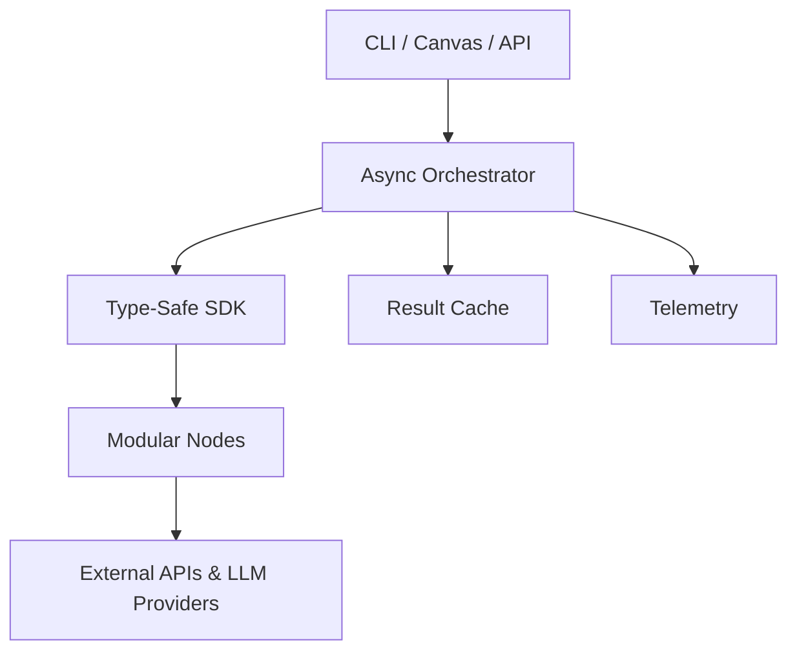

# iceOS – The AI-Native Operating Layer for Agentic Workflows

> **Build, run & scale reliable multi-agent AI systems in minutes.**

[](https://github.com/stef-writes/iceOSv1-A-/actions/workflows/ci.yml)

---

## 1. Why iceOS?

Modern AI products require orchestrating many moving parts: calling multiple LLMs, deterministic tools, branching logic, retries, auditing, cost control and more. Stitching this together from scratch means gluing SDKs, schedulers and guard-rails – every team re-implements the same boilerplate and still ends up with brittle pipes.

**iceOS** is an open-source operating layer that turns these moving parts into a declarative workflow DAG executed by an async engine with built-in guard-rails:

* **Composable Nodes** – Ingress (webhook), LLM, Tool, Condition, Agent, Sink.  
* **Type-Safe SDK** – Pydantic-powered contracts catch integration bugs before runtime.  
* **Deep Guard-Rails** – depth, token & semantic limits plus pluggable policy hooks.  
* **Level-Parallel Executor** – maximises concurrency without violating dependencies.  
* **Self-Optimising Runtime** – telemetry loop learns & rewrites flows for latency/cost.

_Result: teams focus on product logic, not plumbing._

---

## 2. What Can You Build Today?

| Use-Case | Nodes Used | Outcome |
|----------|-----------|---------|
| **Weekly Research Digest** | Webhook → FileSearch → LLM (summarise) → Email | PDF folder summarised & mailed every Friday |
| **GitHub Issue Triager**   | GitHub Ingress → Agent → Label Tool           | Issues labelled & prioritised in seconds |
| **Slack Knowledge Bot**    | Slack → Agent (LLM + WebSearch) → Slack       | Org-wide Q&A with source citations |
| **ETL Data Pipeline**      | SQL Fetch → Condition → Validator → S3 Sink   | Valid, versioned dataset ready for BI |

---

## 3. Quick Start (2 min)

```bash
# Clone & enter repo
git clone https://github.com/stef-writes/iceOSv1-A-.git && cd iceOSv1-A-

# Create virtual-env and install deps
python -m venv .venv && source .venv/bin/activate
pip install -e .[dev]

# Run a demo chain
python scripts/demo_run_chain.py
```

---

## 4. Architecture at a Glance



---

## 5. Key Differentiators

1. **Guard-Rails First** – Enterprise-grade policies baked in; not an after-thought.  
2. **Pythonic DX** – IDE auto-completion, Ruff, MyPy & Pyright enforced out-of-the-box.  
3. **Async Level Parallelism** – <40 µs overhead per node; scales to hundreds of tools.  
4. **Plug-in Ecosystem** – Discover & install nodes with `ice sdk create-node`.

---

## 6. Roadmap Snapshot (H2 2025)

| Quarter | Milestone | Highlights |
|---------|-----------|------------|
| Q3 → v0.3 | **Frozen Public SDK** | Manylinux wheels, generated API docs |
| Q3 | **Developer CLI GA** | `ice new`, hot-reload, auto-registration |
| Q4 | **Frosty Copilot α** | NL canvas that generates live workflows |
| Q4 | **Marketplace α** | Verified node registry & auto-update |

---

## 7. Community & Support

• **Slack** – join `ice-community.slack.com` for questions & pairing  
• **GitHub Discussions** – roadmap input & showcase your flows  
• **Commercial Support** – email `team@iceos.ai` for SLA packages  

---

## 8. Licence

iceOS is **MIT-licensed** – free for personal & commercial use. We welcome contributions via issues & pull requests!

---

### Development

Run the full test-suite locally:

```bash
make test
```

Lint & type-check:

```bash
make lint
```

Clean up artefacts:

```bash
make clean
```

---

> *Last updated: June 2025*
