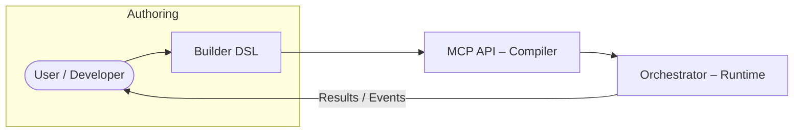

# iceOS – Intelligent Orchestration Platform

iceOS converts natural-language intent into fully-validated, cost-aware execution graphs that run anywhere 🚀.  It couples a **compiler-grade validation pipeline** with a **high-performance runtime** and a pluggable **builder DSL**, letting you design, test and operate complex multi-agent systems with confidence.



---
## Repository at a Glance
| Layer | Path | Role |
|-------|------|------|
| **Builder DSL** | `src/ice_builder/` | Fluent DSL and toolkits for programmatic blueprint authoring |
| **MCP API (Compiler)** | `src/ice_api/` | Validates `Blueprint`s / `ComponentDefinition`s, performs budget checks, streams events |
| **Orchestrator (Runtime)** | `src/ice_orchestrator/` | DAG execution engine with parallelism, retries, metrics, memory & LLM providers |
| **Core Models & Protocols** | `src/ice_core/` | Pydantic configs, typed exceptions, protocol definitions, unified registry |
| **CLI** | `src/ice_cli/` | One-line helpers (blueprint execution, schema export, doctor, …) |

---
## Key Features
* **12 first-class node types** – tool • llm • agent • condition • workflow • loop • parallel • recursive • code • human • monitor • swarm  
  Defined in [`ice_core.models.node_models`](src/ice_core/models/node_models.py).
* **Unified memory subsystem** – working (RAM/Redis), episodic (Redis), semantic (vector/SQLite) & procedural stores, all addressable through `ice_core.memory.*`.
* **Incremental design-time validation** – `PartialBlueprint` → `Blueprint` with schema-level and cross-node checks before runtime.
* **Selective WASM sandboxing** – untrusted *code* and *condition* nodes run in a locked-down environment; trusted nodes keep full Python power.
* **Structured logging & OpenTelemetry** – every run emits rich, provider-agnostic telemetry out-of-the-box.
* **Cost & token accounting** – per-node and aggregate budgets enforced at compile-time and monitored at runtime.
* **Extensible registries** – declarative plugin manifests enable deterministic, offline operation (`docs/generated/manifest_auto.md`).

---
## Installation
iceOS uses [Poetry](https://python-poetry.org/) for dependency management.  Ensure Python ≥ 3.10 is available, then run:

```bash
# clone & enter the repo
$ git clone https://github.com/<your-org>/iceOS.git && cd iceOS
# create virtual-env, install core + dev extras, set up git hooks
$ make setup
```

> **Hint** – `make help` lists every available target.

---
## Quick Start
```bash
# 1️⃣ Run the test-suite (optional but recommended)
$ make test

# 2️⃣ Spin up Redis & start the API (Docker required for the Redis helper)
$ make dev               # starts Redis (via Docker) + hot-reloaded API

# 3️⃣ Copy the environment template and add your API keys (optional but recommended)
$ cp config/dev.env.example .env

# 4️⃣ Execute a blueprint (local runtime)
$ poetry run ice run-blueprint examples/hello_world.json
```

Need a blueprint?  Generate one programmatically:
```python
from ice_builder.dsl import workflow, tool
from ice_builder.dsl.network import save_blueprint

with workflow("hello") as wf:
    echo = tool("echo", message="Hello iceOS!")

save_blueprint(wf, "examples/hello_world.json")
```

---
## Project Layout (high level)
```text
src/
 ├─ ice_core/          # Shared models, utils, registries, memory
 ├─ ice_orchestrator/  # Execution engine (+ agents, tools, providers)
 ├─ ice_api/           # Compiler / validation API (FastAPI JSON-RPC + stdio)
 ├─ ice_builder/       # Authoring DSL + natural-language pipeline
 ├─ ice_cli/           # Thin Click wrapper around common tasks
 └─ ice_client/        # Async client for remote orchestrator
```
A full, generated layout with every file is available in `docs/generated/architecture_auto.md`.

---
## Documentation
* **Generated docs** – `docs/generated/*`
* **Generated API & schema docs** – `docs/generated/*`
* **Roadmap** – `docs/Looking_Forward/iceos-comprehensive_vision_roadmap.md`

The Markdown site can be built locally with:
```bash
$ make docs   # outputs to ./site/
```

---
## Contributing
Please read [`CONTRIBUTING.md`](CONTRIBUTING.md) for coding standards, architectural boundaries and CI requirements.  Highlights:
1. **Strict typing** – `mypy --strict` must pass.
2. **Coverage ≥ 90 %** on changed lines.
3. Use **Google-style doc-strings** & **Pydantic models** for all public APIs.
4. External side-effects live only inside *Tool* implementations.

---
## License
iceOS is released under the MIT License – see [`LICENSE`](LICENSE) for details.
