# iceOS v1 (A) – Intelligent Orchestration Platform

iceOS is an open-source platform that turns natural-language requests into validated, cost-aware, and executable workflows.

```mermaid
flowchart LR
    subgraph "Interpreter – Frosty"
        U([User]) --> F[Frosty]
    end
    F --> C[MCP API – Compiler]
    C --> R[Orchestrator – Runtime]
    R -->|Events| F
    R -->|Results| U
```



## Key Layers
| Layer | Repository Path | Purpose |
|-------|-----------------|---------|
| Frosty *(Interpreter)* | `src/frosty/` | NL intent → PartialBlueprints, memory-aware reasoning |
| MCP API *(Compiler)* | `src/ice_api/` | Blueprint validation, budget checks, event streaming |
| Orchestrator *(Runtime)* | `src/ice_orchestrator/` | DAG execution, agents, runtime services, metrics |
| Core Models | `src/ice_core/` | Pydantic configs, protocols, unified registry |
| Developer SDK | `src/ice_sdk/` | Tool & workflow builders, client helpers |

## Current Capabilities
* 11 first-class node types (`tool`, `llm`, `agent`, `code`, `condition`, `loop`, `parallel`, `recursive`, `human`, `monitor`, `workflow`) – see `ice_core.models.node_models`.
* Unified memory system – Working, Episodic (Redis), Semantic (vector/SQLite), Procedural.
* Incremental blueprint construction (`PartialBlueprint`) with live MCP validation.
* NetworkX-powered graph analysis for critical-path and optimization insights.
* Network manifests (`network.v0`) for orchestrating multiple workflows with dependency graphs & shared global config.
* Extensible tool registry – start with `AgentTool` (exposes agents via the tool protocol) and a growing set of domain-specific tools in `src/ice_sdk/tools/`.
* **Toolkit pattern** – group related tools (e.g. `GitHubToolkit`, `SQLDatabaseToolkit`, `GmailToolkit`) with idempotent validation and optional extras.
* **Agent-as-Tool bridge** – expose any agent via the standard `ToolBase` protocol (`ice_orchestrator.tools.AgentTool`), enabling agents to slot into existing tool nodes.
* Selective WASM sandboxing for untrusted code nodes.
* Structured logging & OpenTelemetry tracing out-of-the-box.
* Draft → Blueprint → Workflow compiler pipeline with instant validation feedback (see docs).

## Quick Start
```bash
# Install (requires Poetry)
make install
# Run API server
poetry run uvicorn ice_api.main:app --reload
# Execute a demo workflow
python use_cases/RivaRidge/FB_Marketplace_Seller/run_blueprint.py
```

## Project Status
* Foundation complete (Core, Orchestrator, API, SDK).
* Frosty scaffold added (perception, reasoning, memory, synthesis, metacognition).
* Canvas UI in progress (not in this repo).
* See `docs/Looking_Forward/iceos-comprehensive_vision_roadmap.md` for future work.

## 🗓️ Upcoming Milestones

* **Git-clone to JSON** *(target: tomorrow)* — Major DX milestone: after `git clone` and `poetry install`, a developer needs only the JSON schemas (Blueprints & ComponentDefinitions) plus the fluent-API builders to create tools, agents (including recursive & swarm variants), and full workflows.  Spin up the JSON specs first to design, then wire them together in Python with the fluent API — no Frosty required.

  > “Clone → write JSON → import builders → run” will be the shortest path from idea to a live, orchestrated multi-workflow system.

* **Manifest-Driven Registry – Milestone A** *(+3 days)* — Define `plugins.v0` schema, implement loader, and add `--no-dynamic` flag for deterministic runtime.
* **Manifest-Driven Registry – Milestone B** *(+1 week)* — CLI commands `ice plugins export|lint`, CI gate, and autodiscovery helper.
* **Manifest-Driven Registry – Milestone C** *(ongoing)* — Marketplace backend with signed bundles, search UI, and billing hooks.

---
MIT License · © iceOS Contributors 