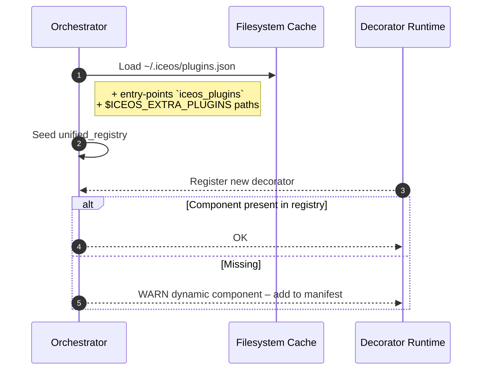

# Manifest-Driven Registry for iceOS

## 🎯 Purpose & Rationale

iceOS already guarantees deterministic *workflows* (Blueprints → MCP → Orchestrator).  What we are
missing is deterministic *component* discovery.  Relying solely on `@tool` / `@agent` decorators and
runtime `importlib` scanning has three shortcomings:

1. **Reproducibility** – A build can silently pick up new local modules.
2. **Security** – Supply-chain tools cannot audit dynamic imports until after code executes.
3. **Monetisation** – A marketplace cannot index or price opaque Python packages.

A signed, versioned `plugins.json` manifest fixes these problems while *retaining* decorator DX.
This document specifies the schema, loading algorithm, developer workflow, CI gates, and a phased
roll-out plan.

---

## 1 Artefacts & Visibility Matrix

| Persona / Phase | Needs | Artefact |
|-----------------|-------|----------|
| **Developer (local)** | Fast iteration | Python classes + decorators → _auto-generated_ `plugins.json` preview |
| **Designer (Frosty / Canvas)** | Name, type, I/O schema, cost | `plugins.json` (public subset) |
| **MCP Compiler** | Compile-time guarantees | `plugins.json` + allow-listed remote manifests |
| **Orchestrator** | Deterministic runtime | Local manifest cache; `--no-dynamic` strict flag |
| **Marketplace** | Distribution & billing | Manifest bundle (`plugins.json` + wheel + signature) |

---

## 2 `plugins.json` Schema (v0)

```jsonc
{
  "schema_version": "plugins.v0",
  "created": "2025-08-01T12:34:00Z",
  "components": [
    {
      "node_type": "tool",             // tool | agent | workflow
      "name": "csv_reader",            // registry name
      "import": "my_pkg.csv:CsvReader", // module:Attribute – *no eager import*
      "version": "1.2.3",              // SemVer of the component itself
      "iceos_min": "1.0.0",            // optional – min iceOS version
      "schema": {
        "input": { "$ref": "#/schemas/CsvReaderInput" },
        "output": { "$ref": "#/schemas/CsvReaderOutput" }
      },
      "cost_estimate": {
        "base": 0.0001,
        "per_token": 0.0
      },
      "tags": ["csv", "io"],
      "description": "Fast CSV parsing with streaming support",
      "deprecated": {
        "since": "2.0.0",
        "replacement": "parquet_reader"
      }
    }
  ],
  "signature": {
    "algo": "ed25519",
    "value": "base64-signature…",
    "public_key_id": "iceos-root-2025"
  }
}
```

### Integrity Guarantees
* **Signature** is computed over the *concatenation* of the wheel’s SHA-256 and the manifest’s
  SHA-256 so that tampering with either invalidates provenance.
* `public_key_id` allows offline clusters to fetch the correct key from a local key-store.

---

## 3 Hybrid Loading Algorithm



* `--no-dynamic` flag turns WARN into a hard error for prod clusters.
* CI task `ice plugins lint` fails the build if *any* warnings were emitted during tests.

---

## 4 Developer Workflow

```text
1. @tool / @agent / @workflow decorator as today
2. poetry run ice plugins export  > plugins.json
3. git add plugins.json && git commit –m "feat: update plugin manifest"
4. ice publish --manifest plugins.json  # bundles wheel + manifest + sig
```

`ice plugins export` walks the codebase, discovers decorators, and produces a deterministic
manifest sorted by `(node_type, name)` so diffs remain stable.

---

## 5 Marketplace Moat

* **Searchability** – Vector + keyword index derived from `description`, `schema`, and examples.
* **Governance hooks** – MCP performs policy scan & cost validation offline before acceptance.
* **Re-usability without source** – Canvas & SDK need only metadata to compose complex systems.
* **Lock-file semantics** – Teams pin component version hashes; upgrades are explicit & reviewable.

---

## 6 Implementation Road-map

| Milestone | ETA | Scope |
|-----------|-----|-------|
| **A** | +3 days | • Define `plugins.v0` Pydantic model in `ice_core.models.plugins`.<br/>• Implement `unified_registry.load_plugins()`.<br/>• Add `--no-dynamic` flag + runtime warnings. |
| **B** | +1 week | • CLI: `ice plugins export` & `ice plugins lint`.<br/>• CI job blocks on lint.<br/>• Autodiscovery helper in `ice_sdk.autodiscover`. |
| **C** | ongoing | • Marketplace backend (signed manifest + wheel storage).<br/>• UI search using same schema.<br/>• Billing & licence hooks. |

---

## 7 Testing & CI Strategy

1. **Unit tests** cover Pydantic schema round-trip and loader edge cases.
2. **Integration tests** spin up a temp dir, write manifest, then run Orchestrator with `--no-dynamic`.
3. **Static checks** – `make plugins-test` runs:
   * `ice plugins lint`
   * `mypy --strict` on generated stubs (`ice_core.models.plugins` → `TypedDict`)
   * Hash verification against committed `plugins.json`.

---

## 8 Risk Matrix & Mitigations

| Risk | Impact | Mitigation |
|------|--------|-----------|
| Manifest drift | Non-reproducible builds | CI lint fails if runtime warns. |
| Cold-start DX regression | New devs forget to export plugins | Runtime fallback + prominent WARN; tutorials highlight command. |
| Spec churn | Upgrade friction | Freeze `plugins.v0`; additive only until `v1`. |
| Marketplace delay | Monetisation postponed | Allow `$ICEOS_EXTRA_PLUGINS` for signed local bundles. |

---

## 9 Glossary

* **Component** – A first-class registry item: tool, agent, or workflow.
* **Manifest** – JSON file listing components & metadata, signed for integrity.
* **Decorator DX** – The developer experience of declaring components via Python decorators. 