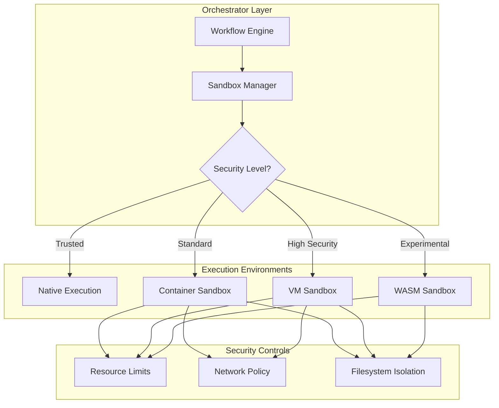

# iceOS Sandboxing Plan

> **Status**: Planning Phase  
> **Priority**: High (Security Critical)  
> **Target**: Q2-Q3 2025  
> **Last Updated**: December 2024

## Executive Summary

iceOS currently executes code directly without sandboxing, presenting significant security risks. This document outlines a comprehensive plan to implement proper sandboxing while maintaining the flexibility needed for AI workflows.

**Key Points**:
- 🚨 **Current State**: No sandboxing - arbitrary code execution possible
- 🎯 **Goal**: Defense-in-depth with configurable isolation levels
- 🏗️ **Approach**: Phased implementation starting with containers
- ⚡ **Trade-offs**: Security vs performance vs complexity

## Current State Analysis

### What Exists Today

```python
# Current execution model - UNSAFE
class CodeNode:
    async def execute(self, inputs):
        exec(self.code, context)  # Direct execution!
        
class ComputerTool:
    async def execute(self, action):
        pyautogui.click(x, y)  # System-level access!
```

### Security Measures (Minimal)
- ✅ Basic path sanitization (`ice_core/utils/security.py`)
- ✅ Limited Python builtins in CodeNode
- ✅ AST syntax validation
- ❌ No process isolation
- ❌ No resource limits
- ❌ No network isolation
- ❌ No filesystem sandboxing

### Risk Assessment

| Risk | Impact | Likelihood | Priority |
|------|--------|------------|----------|
| Arbitrary code execution | Critical | High | P0 |
| Resource exhaustion | High | Medium | P1 |
| Data exfiltration | Critical | Medium | P0 |
| System compromise | Critical | Low | P1 |
| Cross-workflow contamination | Medium | High | P2 |

## Sandboxing Architecture

### Design Principles

1. **Defense in Depth**: Multiple layers of isolation
2. **Configurable Security**: Different levels for different needs
3. **Performance Aware**: Minimize overhead for safe operations
4. **Developer Friendly**: Easy to use correctly, hard to misuse
5. **Audit Ready**: Complete execution logs and traces

### Proposed Architecture



### Sandbox Configuration Model

```python
from pydantic import BaseModel
from enum import Enum
from typing import List, Optional, Dict

class SecurityLevel(Enum):
    TRUSTED = "trusted"      # No sandboxing (internal tools only)
    STANDARD = "standard"    # Container isolation
    HIGH = "high"           # VM isolation
    EXPERIMENTAL = "experimental"  # WASM isolation

class ResourceLimits(BaseModel):
    max_cpu_seconds: float = 10.0
    max_memory_mb: int = 512
    max_disk_mb: int = 100
    max_processes: int = 10
    max_open_files: int = 100
    max_network_connections: int = 10

class NetworkPolicy(BaseModel):
    enabled: bool = False
    allowed_hosts: List[str] = []
    allowed_ports: List[int] = []
    dns_servers: List[str] = ["8.8.8.8"]
    rate_limit_per_second: int = 10

class FilesystemPolicy(BaseModel):
    read_only: bool = True
    allowed_paths: List[str] = ["/tmp"]
    max_file_size_mb: int = 10
    allowed_operations: List[str] = ["read", "write", "create"]

class SandboxConfig(BaseModel):
    security_level: SecurityLevel = SecurityLevel.STANDARD
    resource_limits: ResourceLimits = ResourceLimits()
    network_policy: NetworkPolicy = NetworkPolicy()
    filesystem_policy: FilesystemPolicy = FilesystemPolicy()
    timeout_seconds: float = 30.0
    environment_vars: Dict[str, str] = {}
    syscall_whitelist: Optional[List[str]] = None
```

## Implementation Strategy

### Phase 1: Foundation (Prerequisites)

**Timeline**: 4-6 weeks

1. **Abstract Sandbox Interface**
   ```python
   class SandboxExecutor(Protocol):
       async def execute(
           self,
           code: str,
           inputs: Dict[str, Any],
           config: SandboxConfig
       ) -> ExecutionResult: ...
   ```

2. **Execution Result Model**
   ```python
   class ExecutionResult(BaseModel):
       success: bool
       output: Dict[str, Any]
       logs: List[str]
       metrics: ResourceMetrics
       security_events: List[SecurityEvent]
   ```

3. **Security Event Tracking**
   ```python
   class SecurityEvent(BaseModel):
       timestamp: datetime
       event_type: str  # "network_blocked", "syscall_denied", etc.
       details: Dict[str, Any]
       severity: str  # "info", "warning", "critical"
   ```

### Phase 2: Container Sandboxing

**Timeline**: 6-8 weeks

**Technology**: Docker/Podman with gVisor runtime

```python
class DockerSandboxExecutor(SandboxExecutor):
    async def execute(self, code: str, inputs: Dict[str, Any], config: SandboxConfig):
        container_config = {
            "image": "python:3.11-slim",
            "command": ["python", "-c", code],
            "environment": {
                "PYTHONUNBUFFERED": "1",
                "INPUTS": json.dumps(inputs),
                **config.environment_vars
            },
            "host_config": {
                "mem_limit": f"{config.resource_limits.max_memory_mb}m",
                "cpu_quota": int(config.resource_limits.max_cpu_seconds * 100000),
                "network_mode": "none" if not config.network_policy.enabled else "bridge",
                "read_only": config.filesystem_policy.read_only,
                "tmpfs": {"/tmp": "size=100M,mode=1777"},
                "security_opt": ["no-new-privileges"],
                "cap_drop": ["ALL"],
                "runtime": "runsc"  # gVisor for additional isolation
            }
        }
        
        # Execute and monitor...
```

**Security Features**:
- Seccomp profiles for syscall filtering
- AppArmor/SELinux policies
- User namespace remapping
- Read-only root filesystem
- No capabilities by default

### Phase 3: Advanced Isolation

**Timeline**: 8-12 weeks

**Options**:

1. **Firecracker MicroVMs**
   - Sub-second boot times
   - Strong isolation
   - KVM-based security
   - Good for high-security workflows

2. **WebAssembly (WASM)**
   - Deterministic execution
   - Platform independent
   - Limited system access by design
   - Good for pure computation

3. **Kata Containers**
   - VM-level isolation
   - Container-like UX
   - Hardware virtualization
   - Good balance of security/usability

### Phase 4: Production Hardening

**Timeline**: 4-6 weeks

1. **Performance Optimization**
   - Sandbox pool pre-warming
   - Resource recycling
   - Execution caching
   - Network optimization

2. **Monitoring & Alerting**
   - Security event aggregation
   - Anomaly detection
   - Resource usage tracking
   - Compliance reporting

3. **Integration Testing**
   - Penetration testing
   - Fuzzing
   - Load testing
   - Chaos engineering

## Architectural Impacts

### Node Execution Changes

```python
# Before: Direct execution
class CodeNode(BaseNode):
    async def _execute_impl(self, inputs: Dict[str, Any]) -> Dict[str, Any]:
        exec(self.code, {"inputs": inputs})
        
# After: Sandboxed execution
class CodeNode(BaseNode):
    sandbox_config: SandboxConfig = SandboxConfig()
    
    async def _execute_impl(self, inputs: Dict[str, Any]) -> Dict[str, Any]:
        executor = SandboxManager.get_executor(self.sandbox_config.security_level)
        result = await executor.execute(
            code=self.code,
            inputs=inputs,
            config=self.sandbox_config
        )
        return result.output
```

### Workflow Configuration

```yaml
# Workflow blueprint with sandbox settings
nodes:
  - id: untrusted_code
    type: code
    code: |
      import requests
      result = requests.get("https://api.example.com")
    sandbox:
      security_level: high
      network_policy:
        enabled: true
        allowed_hosts: ["api.example.com"]
      resource_limits:
        max_cpu_seconds: 5.0
        max_memory_mb: 256
```

### Performance Considerations

| Operation | Current | Sandboxed | Overhead |
|-----------|---------|-----------|----------|
| Simple calculation | 1ms | 5ms | 4ms |
| With container pool | 1ms | 2ms | 1ms |
| Network request | 100ms | 105ms | 5ms |
| File operation | 10ms | 15ms | 5ms |
| First execution | 1ms | 500ms | 499ms |

## Decision Points

### 1. Sandbox Granularity

**Options**:
- A) Per-node sandboxing (maximum isolation)
- B) Per-workflow sandboxing (better performance)
- C) Per-session sandboxing (best performance)

**Recommendation**: Start with A, optimize to B where safe

### 2. Default Security Level

**Options**:
- A) Opt-in sandboxing (backward compatible)
- B) Opt-out sandboxing (secure by default)
- C) Mandatory sandboxing (no escape hatch)

**Recommendation**: B with migration period [[memory:4264939]]

### 3. Technology Stack

**Options**:
- A) Docker + gVisor (mature, well-tested)
- B) Firecracker (modern, lightweight)
- C) WebAssembly (future-proof, limited)

**Recommendation**: A for phase 2, evaluate B/C for phase 3

### 4. Resource Management

**Options**:
- A) Hard limits (kill on exceed)
- B) Soft limits (throttle on exceed)
- C) Elastic limits (scale with budget)

**Recommendation**: A for security, B for UX

## Prerequisites Checklist

Before implementation, ensure:

### Technical Prerequisites
- [ ] Container runtime available (Docker/Podman)
- [ ] Orchestrator supports async execution
- [ ] Monitoring infrastructure ready
- [ ] Security team review completed

### Architectural Prerequisites  
- [ ] SandboxExecutor protocol defined
- [ ] ExecutionResult model finalized
- [ ] Config propagation mechanism ready
- [ ] Error handling strategy defined

### Operational Prerequisites
- [ ] Performance baselines established
- [ ] Security policies documented
- [ ] Incident response plan ready
- [ ] User communication plan

## Migration Strategy

### Phase 1: Opt-in Beta
- Enable sandboxing for specific workflows
- Gather performance metrics
- Identify compatibility issues
- Build user trust

### Phase 2: Opt-out Default
- Sandbox by default for new workflows
- Allow opt-out with warnings
- Monitor security events
- Provide migration tools

### Phase 3: Mandatory Enforcement
- Remove opt-out capability
- Require security justification for TRUSTED level
- Full audit logging
- Compliance certification

## Success Metrics

### Security Metrics
- Zero arbitrary code execution incidents
- 100% of untrusted code sandboxed
- < 1% false positive security blocks
- 99.9% sandbox escape prevention

### Performance Metrics
- < 10ms overhead for standard operations
- < 500ms cold start with pre-warming
- < 5% total workflow overhead
- 90% sandbox pool hit rate

### Developer Experience
- 95% workflows work without modification
- < 5 minutes to configure sandbox
- Clear error messages for violations
- Debugging tools available

## Open Questions

1. **Stateful Operations**: How do agents with memory work across sandbox boundaries?
2. **Tool Interactions**: Should tools be sandboxed separately from nodes?
3. **Data Serialization**: What's the overhead of data transfer to/from sandboxes?
4. **Debugging Experience**: How do developers debug sandboxed code?
5. **Cost Model**: How does sandboxing affect pricing and resource allocation?

## Related Documents

- [ARCHITECTURE.md](./ARCHITECTURE.md) - Overall system architecture
- [iceos-vision.md](./iceos-vision.md) - Platform vision including security goals
- [protocols.md](./protocols.md) - Protocol patterns that sandboxing must respect

## Next Steps

1. **Technical Spike**: Prototype container sandboxing (2 weeks)
2. **Performance Testing**: Benchmark overhead (1 week)
3. **Security Review**: External audit of approach (2 weeks)
4. **API Design**: Finalize SandboxExecutor protocol (1 week)
5. **Implementation Plan**: Detailed project plan (1 week)

---

> **Note**: This is a living document. As we make architectural decisions, we should reference this plan to ensure alignment with sandboxing requirements. Any decision that makes sandboxing harder should be carefully reconsidered. 