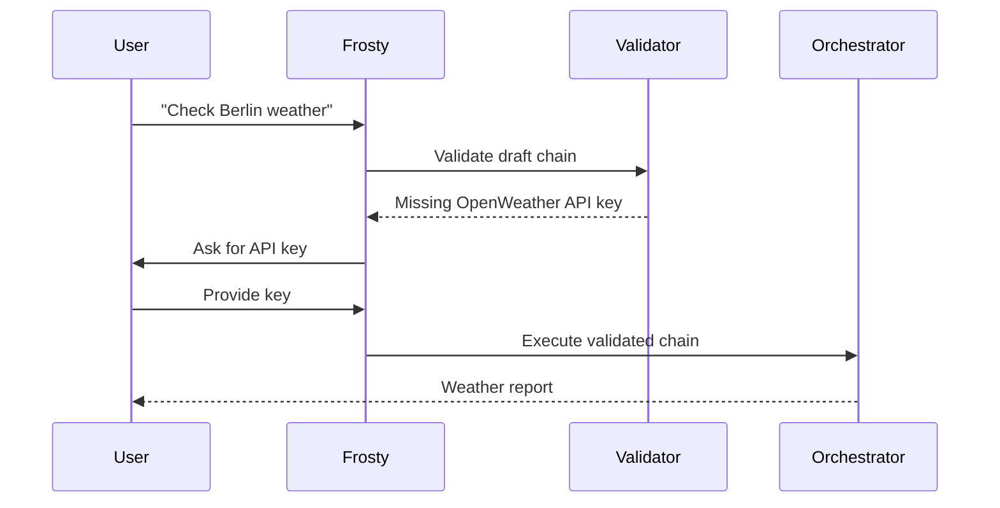

# Frosty AI Service

## Overview
AI copilot for chain construction. Uses:
- Training data from `examples/scenarios/`
- Validation service (`ChainValidator`)
- Context type system (`ContextTypeManager`)

```python
from ice_sdk.services import FrostyAIService

async def create_chain(prompt: str) -> Blueprint:
    frosty = FrostyAIService()
    return await frosty.generate_chain_interactive(prompt)
```

## Interactive Workflow


## Methods
### `generate_chain(prompt: str) -> ChainSpec`
- Auto-generates chain without user input
- Throws `ValidationError` if unresolved issues

### `generate_chain_interactive(prompt: str) -> ChainSpec`
- Interactive version that asks for missing inputs
- Implements "socratic" questioning flow 