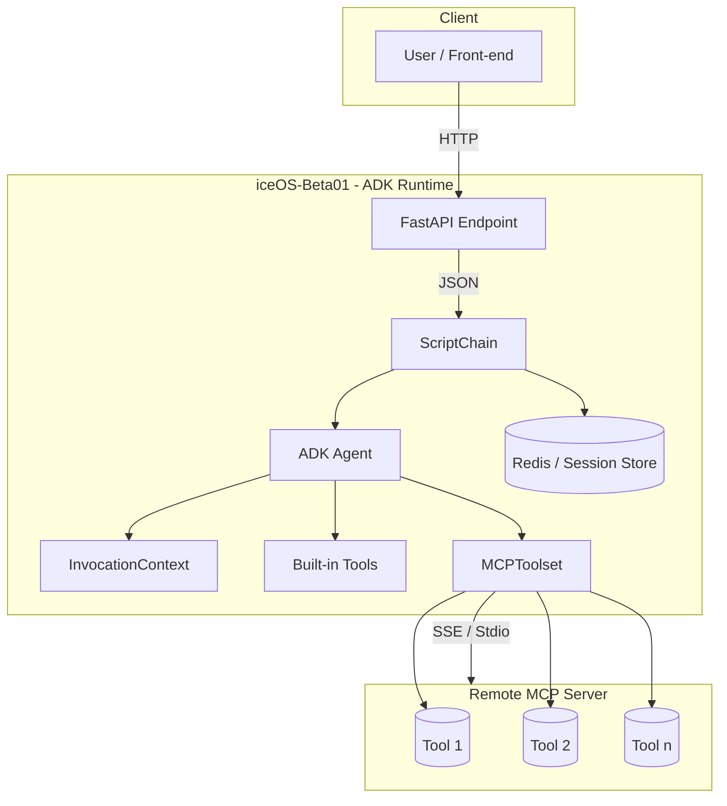
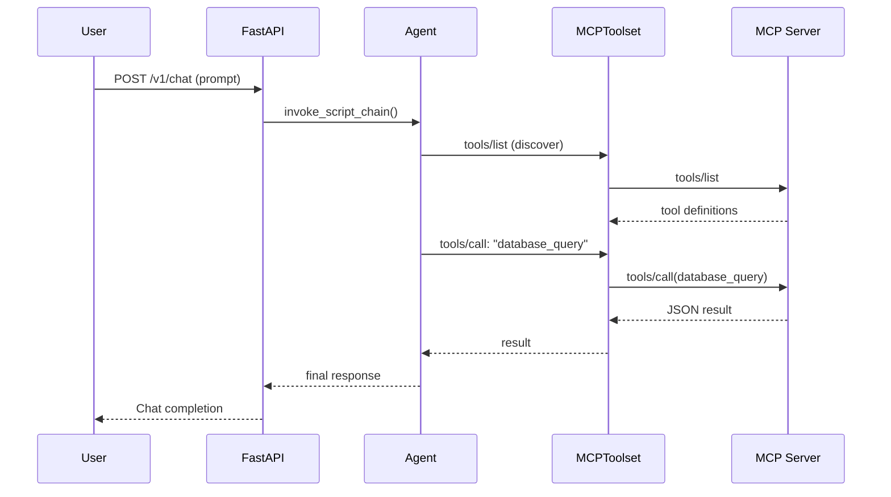
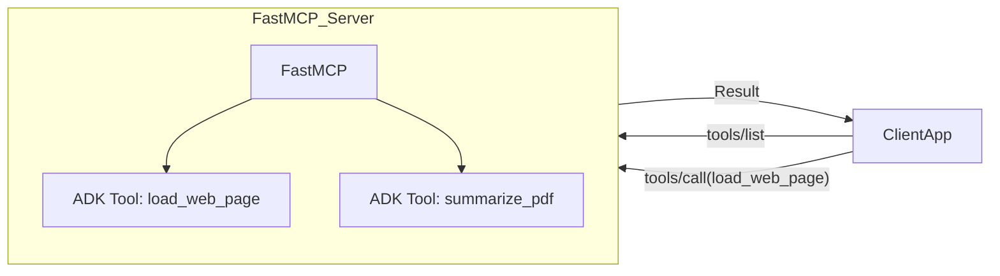
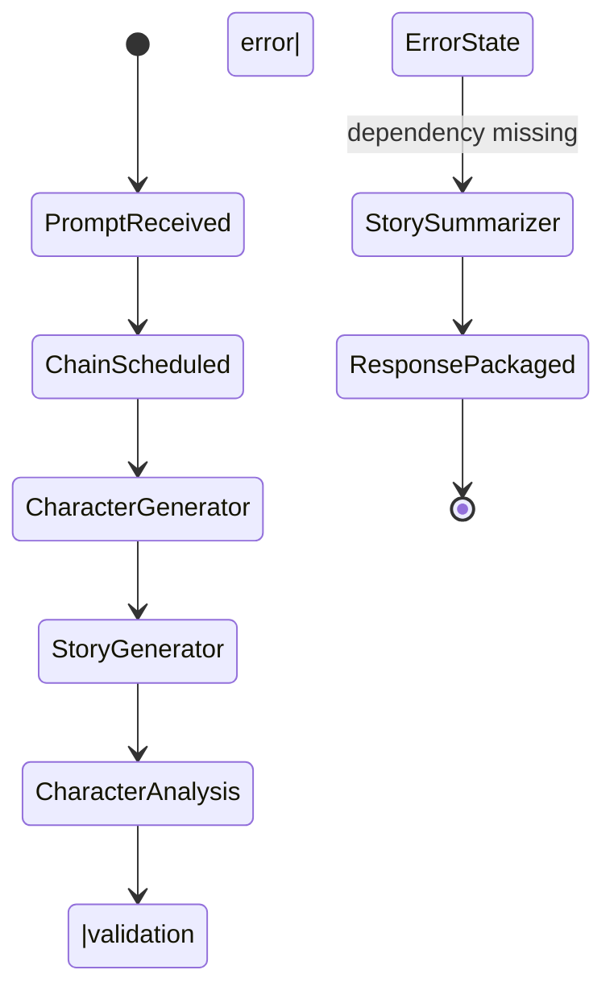

# Architecture & Workflow Documentation

> This document gives a birds-eye view of how our current ADK-based agent integrates (or will integrate) with MCP, what the internal runtime objects look like, and how requests flow from users all the way to external services.

---

## 1. High-level System Architecture



**Legend**  
• Boxes = processes/objects.  
• Rounded boxes = storage or persistent state.  
• Arrows = direction of request/response.

---

## 2. Core Runtime Data Models

Below are simplified (Python / Pydantic-like) schemas of the most critical ADK context objects.

```python
class InvocationContext(BaseModel):
    # Immutable per invocation
    invocation_id: str
    session: Session
    agent: "BaseAgent"

    # Mutable namespaces
    state: dict[str, Any]            # temp:/user:/app: keys
    user_content: ContentPartList    # initial user prompt

    # Helpers
    def save_artifact(name: str, content: Part): ...
    def load_artifact(name: str) -> Part: ...
```

```python
class ToolContext(InvocationContext):
    tool_name: str

    # Auth helpers
    def request_credential(config: AuthConfig): ...
    def get_auth_response(config: AuthConfig) -> Credentials: ...

    # Memory helpers
    def search_memory(query: str, top_k: int = 5) -> list[MemoryEntry]: ...
```

```python
class MCPToolset(BaseModel):
    server_params: StdioServerParameters | SseServerParameters
    tools: dict[str, BaseTool]

    async def call(tool_name: str, **kwargs) -> Any: ...
```

---

## 3. Process Workflows

### 3.1 Agent *as* MCP **Client**



### 3.2 Exposing ADK Tool *as* MCP **Server**



---

## 4. Hypothetical End-User Flow (Story Generator Example)

1. **User opens** the Story UI and enters: "Write a fantasy story about three heroes."
2. Front-end **POSTs** the prompt to `/api/v1/chains/execute`.
3. **ScriptChain** schedules nodes: `character_generator → story_generator → character_analysis → story_summarizer`.
4. During `character_analysis`, the LLM triggers a **function_call** → `word_count` (ADK tool).  A validation error occurs because the `text` field is missing.
5. The agent logs the error, skips downstream dependencies that require that output, but continues with nodes that can still run (`character_generator`).
6. Finally, the chain returns a partial story plus characters; the UI displays it.



---

## 5. Next Steps

• Decide whether to start with *Client* integration (`MCPToolset`) or *Server* exposure (FastMCP).  
• Implement missing validation for `word_count` tool to eliminate current errors.  
• Harden state handling (graceful skips vs. retries) for multi-step chains. 