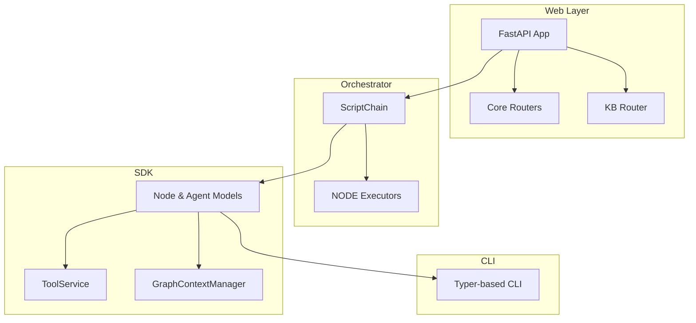

# Architecture

High-level layers:

| Layer | Purpose |
|-------|---------|
| **FastAPI App** | Exposes REST + real-time endpoints for orchestrator, chain-builder and knowledge-base. |
| **Orchestrator** | Executes DAGs with concurrency, caching and metrics. |
| **SDK** | Data models, executors, context and tool abstractions. |
| **CLI** | Local developer ergonomics (chain builder, tool runner, server launcher). |

Dive deeper into each component in the pages that follow. 