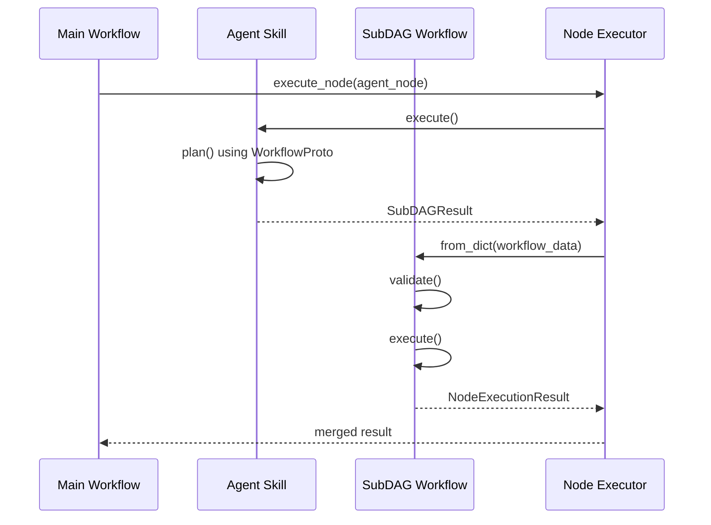

# Agent-Generated SubDAG Integration

This document describes the architecture for enabling agents to dynamically build and execute subDAGs while maintaining layer integrity.

## Overview

The system allows agents to generate workflow definitions at runtime that are then executed as nested workflows within the main orchestration flow. This enables dynamic, agent-driven workflow construction without violating architectural boundaries.

## Architecture Components

### 1. Core Protocol (`WorkflowProto`)

Located in `src/ice_core/models/workflow.py`, this protocol defines the interface for workflow manipulation:

```python
@runtime_checkable
class WorkflowProto(Protocol):
    def add_node(self, config: NodeConfig, depends_on: list[str] | None = None) -> str: ...
    def to_dict(self) -> dict: ...
    @classmethod
    def from_dict(cls, data: dict) -> WorkflowProto: ...
    def validate(self) -> None: ...
```

### 2. SubDAG Container (`SubDAGResult`)

Agents return `SubDAGResult` objects containing serialized workflow data:

```python
class SubDAGResult(BaseModel):
    workflow_data: dict  # Serialized workflow using WorkflowProto.to_dict()
    idempotency_key: str  # SHA-256 hash for duplicate detection
```

### 3. Orchestrator Implementation

The `Workflow` class in `src/ice_orchestrator/workflow.py` implements `WorkflowProto` and handles subDAG execution:

```python
class Workflow(BaseWorkflow, WorkflowProto):
    async def execute_node(self, node_id: str, input_data: Dict[str, Any]) -> NodeExecutionResult:
        result = await self._executor.execute_node(node_id, input_data)
        
        if isinstance(result.output, SubDAGResult):
            subdag = self.workflow_cls.from_dict(result.output.workflow_data)
            subdag.validate()  # Rule 13: validate before execution
            return await self.execute_workflow(subdag)
        
        return result
```

## Execution Flow



## Layer Boundaries

### Service Locator Pattern

To maintain layer integrity, the SDK accesses workflow implementations via service locator:

```python
# src/ice_sdk/services/locator.py
def get_workflow_proto() -> Type[Any]:
    """Late-bound import to prevent layer violations"""
    from ice_orchestrator import Workflow
    return Workflow
```

### Error Handling

SubDAG-specific errors are handled through typed exceptions:

```python
class SubDAGError(WorkflowError):
    """Raised when subDAG validation or execution fails"""
    def __init__(self, message: str, workflow_data: dict):
        super().__init__(message)
        self.workflow_data = workflow_data
```

## Metrics and Observability

### Execution Time Tracking

SubDAG execution time is tracked separately:

```python
class SubDAGMetrics:
    SUB_DAG_EXECUTION_TIME = 0.0
    
    @classmethod
    def record(cls, execution_time: float) -> None:
        cls.SUB_DAG_EXECUTION_TIME += execution_time
```

### Tracing

OpenTelemetry spans are created for subDAG execution with attributes:

- `subdag.node_count`: Number of nodes in the subDAG
- `subdag.execution_time`: Duration of subDAG execution

## Validation and Safety

### Pre-Execution Validation

Before executing a subDAG, the system validates:

1. **Schema Alignment**: Node configurations match expected schemas
2. **Tool Access**: Nodes have access to required tools/skills
3. **Chain Validation**: DAG structure is valid and acyclic

### Idempotency

SubDAGs include idempotency keys to prevent duplicate execution:

```python
idempotency_key = hashlib.sha256(
    json.dumps(workflow_data, sort_keys=True).encode()
).hexdigest()
```

## Usage Examples

### Agent Skill Implementation

```python
class AgentSkill(SkillBase):
    async def _execute_impl(self, **kwargs) -> SubDAGResult:
        workflow_cls = get_workflow_proto()
        workflow = workflow_cls()
        
        # Agent plans and adds nodes
        workflow.add_node(NodeConfig(...))
        workflow.add_node(NodeConfig(...), depends_on=["node_0"])
        
        return SubDAGResult.from_workflow(workflow)
```

### Testing

```python
@pytest.mark.asyncio
async def test_nested_workflow_execution():
    workflow = Workflow(nodes=[], name="test_workflow")
    
    # Mock agent returning SubDAGResult
    subdag_result = SubDAGResult(
        workflow_data={"nodes": [...], "name": "sub"},
        idempotency_key="..."
    )
    
    result = await workflow.execute_node("agent_node", {})
    assert result.success
```

## Migration Path

1. **Phase 1**: Implement protocol and basic subDAG execution
2. **Phase 2**: Add agent skills that return `SubDAGResult`
3. **Phase 3**: Deprecate legacy agent components
4. **Phase 4**: Remove deprecated code

## Quality Gates

- [ ] Protocol compliance verified with `isinstance(workflow, WorkflowProto)`
- [ ] Layer integrity checks pass (`scripts.check_layers --strict`)
- [ ] Test coverage ≥60% for new code
- [ ] Mypy strict mode passes
- [ ] Integration tests verify end-to-end subDAG execution 