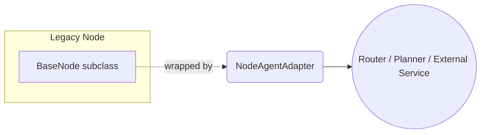

# Agent-centric Architecture

This document explains how *nodes* map to **agents** and how higher-level orchestration maps to ADK-style workflow agents.

## 1. Why an adapter?
`AiNode`, `ToolNode`, and friends already expose an `async execute(context)` method returning a `NodeExecutionResult`; this is identical in spirit to Google ADK's `BaseAgent.execute()` contract.  The new `NodeAgentAdapter` in `src/app/agents/node_agent_adapter.py` is therefore a *thin wrapper* so that any existing node can be used in contexts that expect an **agent** interface without rewriting the node itself.



## 2. Creating an agent from a node
```python
from app.nodes.ai.ai_node import AiNode
from app.agents import NodeAgentAdapter

ai_node = AiNode(config, context_manager, llm_config)
agent = NodeAgentAdapter(ai_node, name="summariser", description="Summarises text with GPT-4o")

result = await agent.execute({"text": "Quantum computing…"})
print(result.output)
```

## 3. Composition
• ***Tool-centric agents*** → wrap `ToolNode`
• ***LLM agents*** → wrap `AiNode`
• ***Workflow agents*** → wrap an entire `LevelBasedScriptChain`

## 4. Future directions
1. **RouterAgent** — inspect user input, choose which `NodeAgentAdapter` (or chain) to invoke.
2. **Planning** — allow an LLM-powered agent to decompose tasks into calls to other agents (already feasible using tool-calling within `AiNode`).
3. **Distributed execution** — because `LevelBasedScriptChain` already supports parallel execution, exposing it as an agent lets higher-level workflows treat a whole DAG as a black-box step.

---
Last updated: {{auto}} 