# iceOS – Comprehensive Architecture & Workflow Diagrams

> The following document aggregates the **deployment**, **runtime**, **data-model**, and **workflow** views of the iceOS ADK-based agent framework.  All diagrams are rendered with Mermaid so that they remain editable by developers.

---

## 1. Deployment / Infrastructure View

```mermaid
flowchart TD
    subgraph Cloud_Region[«AWS / GCP / Azure»]
        subgraph Public_Subnet
            LB[(★ Application Load Balancer)]
        end

        subgraph Private_Subnet
            API[FastAPI ‑ "ice-api"]
            Worker[ScriptChain Executor]\n(Celery / Async Pool)
            Cache[(Redis «session»)]
            DB[(PostgreSQL «metadata»)]
            VectorDB[(Weaviate «embeddings»)]
        end

        subgraph Observability
            Grafana[(Grafana)]
            Loki[(Loki Logs)]
            Tempo[(Tracing / OTel Collector)]
        end

        LB -->|HTTPS| API
        API -->|AMQP / SQS| Worker
        API --> Cache
        Worker --> Cache
        API --> DB & VectorDB
        Worker --> DB & VectorDB
        API --OTel--> Tempo
        Worker --OTel--> Tempo
        Tempo --> Grafana
        Loki --> Grafana
    end

    Developer:::actor -->|CI/CD| Cloud_Region

    classDef actor fill:#fffaf0,stroke:#333,stroke-width:1px;
```

---

## 2. Internal Runtime Component View


---

## 3. Core Data-Model Class Diagram


---

## 4. ScriptChain Execution Levels & DAG


---

## 5. End-to-End Request Sequence (Chat Completion)

```mermaid
sequenceDiagram
    participant FE as Front-End
    participant API as FastAPI
    participant SC as ScriptChain
    participant AN as AiNode
    participant TS as ToolService
    participant LLM as OpenAI

    FE->>API: POST /v1/chat (messages[])
    API->>SC: build_and_execute()
    SC->>AN: execute(context)
    AN->>LLM: ChatCompletion (function-calling)
    LLM-->>AN: response (function_call name="db_query")
    AN->>TS: call_tool(db_query, sql="…")
    TS->>LLM: moderate sql (optional)
    TS-->>AN: query_results
    AN->>LLM: follow-up completion
    LLM-->>AN: assistant reply
    AN-->>SC: NodeExecutionResult
    SC-->>API: ChainExecutionResult
    API-->>FE: 200 OK (assistant reply)
```



---

## 6. Error & Retry Workflow (Node Timeout)


---

### Legend
• *Rounded rectangles* = processes.  
• *Databases* = storage/persistence.  
• Dotted inheritance arrows depict "extends" relationships.  
• Colors and emojis hint at hosting environment but have no semantic meaning.

---
*Last updated: {{auto}}* 