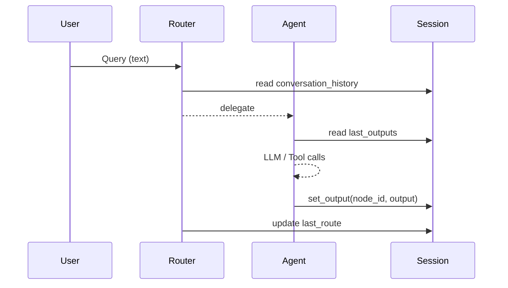

# Context & Memory

`SessionState` + `GraphContextManager` orchestrate *global* and *per-node* memory.

## SessionState
Field             | Purpose
------------------|--------------------------------------------------
`conversation_history` | raw user / assistant messages (for chat agents)
`agent_state`     | arbitrary per-agent scratch space (e.g. last route)
`last_outputs`    | map of `agent_name → last successful output`

Backends: In-mem default; swap to Redis/SQLite by serialising `SessionState.to_dict()`.

## GraphContextManager
*Stores intermediate outputs between nodes inside a workflow (DAG).*  
`update_context(node_id, payload)` is called by `LevelBasedScriptChain` whenever a node finishes.  Nodes can declare `input_mappings` to pull data from upstream dependencies.

## Determinism checklist
1. Declare `output_schema` on LLM nodes → downstream tool gets predictable JSON.  
2. Use `input_mappings` to explicitly select source keys.  
3. Enable `use_cache=True` to avoid recomputation.  
4. Set per-node `timeout_seconds`. 