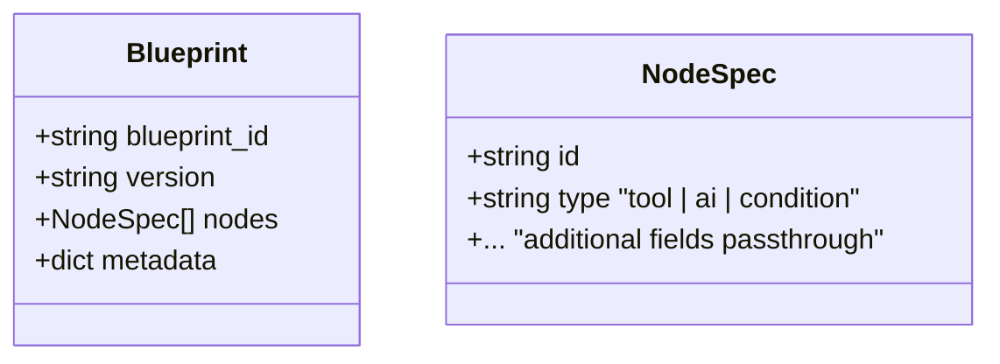
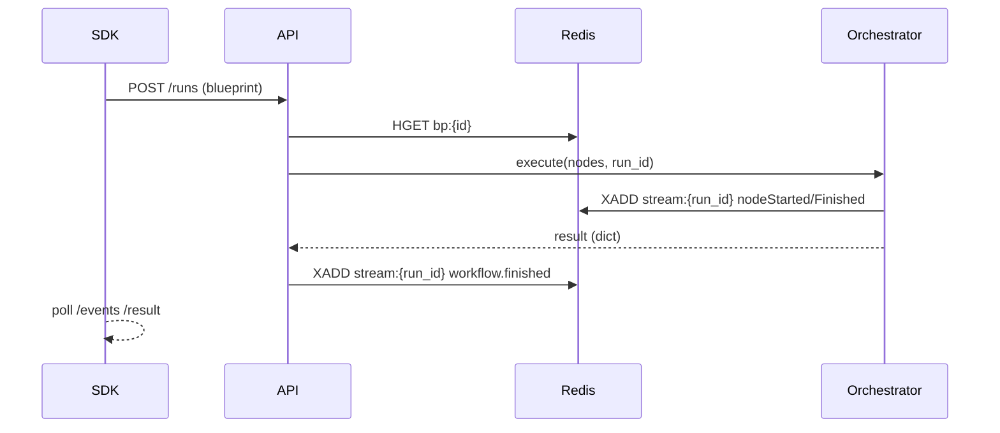

# Model Context Protocol (MCP) – Overview (v0.2.0)

The **Model Context Protocol** is the only contract between design-time tools (Frosty, canvas editors, CLI) and the runtime orchestrator.

Highlights in v0.2.0:

* Redis-backed persistence – blueprints stored as `HASH bp:{id}`, per-run events streamed to `STREAM stream:{run_id}`.
* Unified run-ID generation inside the API layer and propagated end-to-end.
* Per-node telemetry events: `workflow.nodeStarted`, `workflow.nodeFinished`, and the terminal `workflow.finished`.
* Central `NodeSpec → NodeConfig` registry removes manual `if node_type == …` switches.

---

## Data Model



### Runtime validation
`Blueprint.validate_runtime()` converts all NodeSpecs through the registry and raises on first failure.

---

## Endpoint Cheatsheet

| Endpoint | Method | Purpose |
|----------|--------|---------|
| `/api/v1/mcp/blueprints` | POST | Register / upsert a blueprint (Redis `bp:{id}`) |
| `/api/v1/mcp/runs` | POST | Execute blueprint by *id* or inline |
| `/api/v1/mcp/runs/{run_id}` | GET | Final result; 202 while running |
| `/api/v1/mcp/runs/{run_id}/events` | GET (SSE) | Stream node-level events from Redis stream |

### Event payload example

```text
id: 1706520523-0
event: workflow.nodeStarted
data: {"run_id":"run_f3ab","node_id":"sum1"}

id: 1706520524-0
event: workflow.nodeFinished
data: {"run_id":"run_f3ab","node_id":"sum1","success":true}

id: 1706520525-0
event: workflow.finished
data: {"run_id":"run_f3ab","success":true}
```

---

## Design-Tool Integration (SDK example)

```python
from ice_core.models.mcp import Blueprint, NodeSpec
from ice_sdk.protocols.mcp.client import MCPClient

client = MCPClient()

bp = Blueprint(
    blueprint_id="demo",
    nodes=[
        NodeSpec(id="sum1", type="tool", tool_name="sum", tool_args={"a": 2, "b": 3}),
    ],
)

run = await client.start_run(blueprint=bp)
async for evt in client.stream_events(run.run_id):  # hypothetical helper
    print(evt)
result = await client.await_result(run.run_id)
```

---

## Internal Flow



---

> **Maintainers**: update this file when the MCP OpenAPI spec or runtime behaviour changes. 