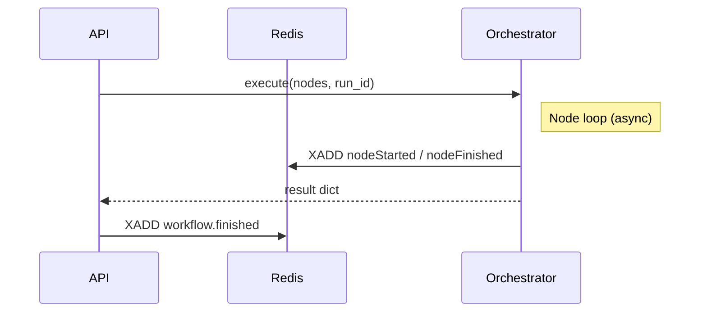

# Orchestrator Execution Flow

High-level execution flow for **Workflow** runs triggered via the MCP API.

 
1. **Workflow** received → validate config
2. Build dependency graph → topological sort
2.5. If chain contains **EnterpriseKBNode**, pre-fetch context via `KnowledgeService` before other AI nodes execute
2.6. If execution is triggered via **ChainExecutorTool** or wrapped inside a **CompositeAgent**, the orchestrator resolves the nested chain(s) and applies the same flow recursively.
3. Schedule node execution (async)
4. Collect NodeExecutionResult → aggregate
5. Emit metrics / telemetry 