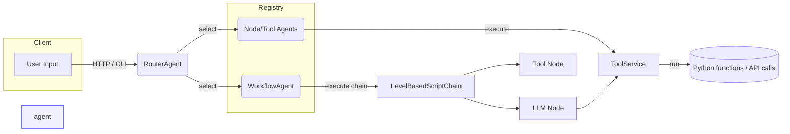

# System Overview

Key layers:

1. **Agents** – entry points (`NodeAgentAdapter`, `WorkflowAgentAdapter`, `RouterAgent`).
2. **Chains** – deterministic orchestration (`LevelBasedScriptChain`).
3. **Nodes** – single unit of work (`AiNode`, `ToolNode`).
4. **Tools** – deterministic side-effects wrapped by `ToolService` (or `AgentTool`).
5. **Context & Memory** – `SessionState` (conversation + last outputs) and `GraphContextManager` (intermediate DAG state).

---
See [Agents & Workflows](agents.md) for a deep dive. 