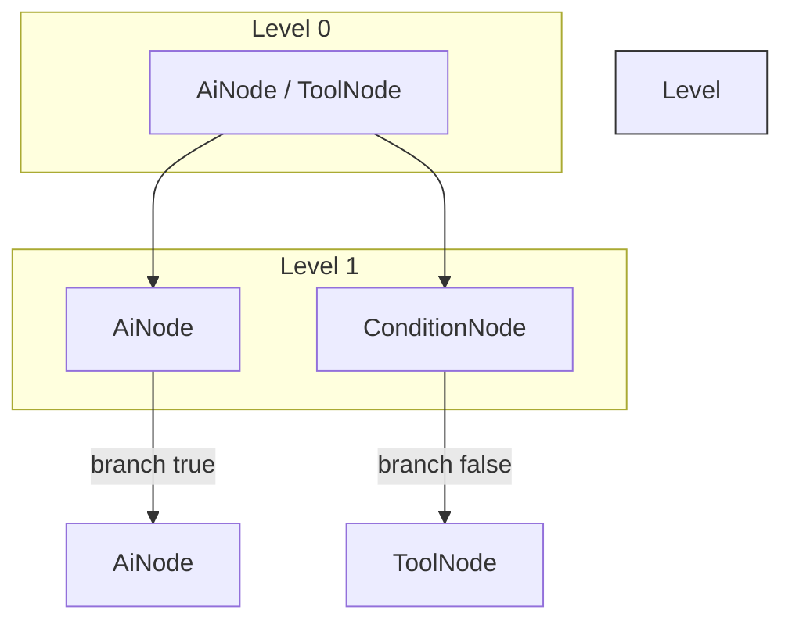

# Core Concepts of iceOS

> A concise yet comprehensive guide to the two pillars that power every workflow: **AiNodes** (reasoning primitives) and **ScriptChain** (the orchestrator).  Master these and the rest of the code-base will feel familiar.

---

## 1. Overview

iceOS is an *operating system* for AI-centric workflows.  Designers describe **what** must be reasoned about using nodes, and the runtime decides **how** that reasoning happens in a safe, observable, and cost-bounded manner.

* **AiNode** – an LLM-powered reasoning block that can optionally call external tools.
* **ScriptChain** – a governance-first scheduler that turns a static node graph into a live, parallel, guarded execution plan.

All higher-level artefacts (FastAPI endpoints, CLI commands, builders, validators) are infrastructure that either produce a `ScriptChain`, feed data into it, or visualise its output.

---

## 2. AiNode – the Reasoning Primitive

| Capability | Description |
|------------|-------------|
| **LLM Prompt** | Each AiNode embeds a prompt template, model settings, and retry/back-off policy. |
| **Tool Access** | The node may be given:<br/>• **Multiple tools** –&nbsp;turns the node into an *agent* that decides which tool(s) to invoke.<br/>• **Single/no tool** –&nbsp;node focuses on formatting input/output for that tool, yielding deterministic behaviour. |
| **Validation** | Implements `validate()` (Rule 13) so bad configs fail fast. |
| **Typed Output** | Pydantic schema ensures downstream nodes receive predictable data. |

### 2.1  Tool Modes

1. **Agent-style AiNode**  
   ```mermaid
   graph LR; A[Prompt + Toolbox] -->|LLM decides| T((Tool Call)) --> B[Final Answer]
   ```
2. **Tool-bound AiNode** (deterministic)  
   ```mermaid
   graph LR; A[Prompt] --> T[[Specific Tool]] --> B[Answer]
   ```

> **Rule of thumb:**  more tools → more adaptability, fewer tools → more predictability.

---

## 3. ScriptChain – the Orchestrator Kernel

| Concern | How ScriptChain Handles It |
|---------|----------------------------|
| **Topology** | Builds a `DependencyGraph`, resolves branch-gates, and groups nodes into *levels* for safe parallelism. |
| **Scheduling** | Uses an async semaphore (`max_parallel`) to run same-level nodes concurrently. |
| **Guards & Limits** | Enforces token and depth ceilings, cache toggles, and pluggable `token_guard` / `depth_guard` hooks. |
| **Failure Policy** | `HALT`, `CONTINUE_POSSIBLE`, or `ALWAYS` – set once, enforced uniformly. |
| **Context Routing** | Creates per-node input dictionaries, merges outputs, and (optionally) persists intermediate data. |
| **Observability** | Emits OpenTelemetry spans + `ChainMetrics` (tokens, cost). |
| **Nested Chains** | `as_nested_node()` lets any chain appear as a single node inside a larger chain – the basis for composition. |

### 3.1  Execution Flow



*ScriptChain* walks levels top-down, running nodes inside each level concurrently up to `max_parallel`.

---

## 4. Putting It Together – a 20-line Example

```python
from ice_orchestrator import ScriptChain
from ice_sdk.models.node_models import AiNodeConfig, ToolNodeConfig
from ice_sdk.tools.builtins.deterministic import SumTool

nodes = [
    AiNodeConfig(
        id="n0",
        name="Generate numbers",
        prompt="Give me two random integers as JSON list",
        llm_config={"provider": "openai", "model": "gpt-3.5-turbo"},
        tools=["json_validator"],  # agent-style
    ),
    ToolNodeConfig(
        id="n1",
        name="Sum",
        tool_name="sum",
        dependencies=["n0"],
        tool_args={},
    ),
]

chain = ScriptChain(nodes=nodes, name="demo", max_parallel=4)
result = await chain.execute()
print(result.model_dump())
```

---

## 5. Why This Design?

1. **Separation of Concerns** – reasoning lives in AiNodes; governance & scheduling live in ScriptChain.
2. **Governance First** – token budgets, depth ceilings, and layer boundaries are enforced centrally (Repo Rules 4–9, 11).
3. **Composable by Default** – nested chains reduce copy-paste and multiply team velocity.
4. **Observability Built-in** – OpenTelemetry + structured metrics mean no “bolt-on” monitoring later.

---

## 6. Glossary

| Term | Meaning |
|------|---------|
| **Node** | Any vertex in the workflow DAG (AiNode, ToolNode, ConditionNode, NestedChain). |
| **Tool** | A side-effecting function/class that obeys Rule 2 (all side-effects live in tools). |
| **Level** | A set of nodes whose dependencies are all satisfied, runnable in parallel. |
| **Branch-gate** | Runtime decision (ConditionNode) that activates or prunes downstream paths. |
| **Session ID** | Unique identifier for a chain run; used for context isolation and tracing. |

---

*Last updated: {{DATE}} – pull requests welcome!* 