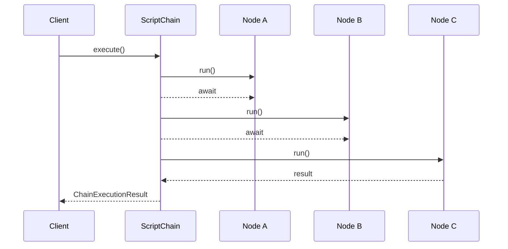

# ScriptChain Execution Model

ScriptChain executes a directed-acyclic graph in *levels* (topological depth).  Nodes on the same level run concurrently up to `max_parallel`.

Key features:

| Feature | Location | Notes |
|---------|----------|-------|
| Failure policies | `FailurePolicy` enum in `ice_sdk.orchestrator.base_script_chain` | `CONTINUE_POSSIBLE`, `HALT_ON_ERROR`, etc. |
| Caching | `ice_sdk.cache` | Hashes node inputs + config |
| Guards | `token_guard`, `depth_guard` callbacks | Abort politely when ceilings exceeded |
| Metrics | `ice_orchestrator.execution.metrics.ChainMetrics` | Aggregates token / cost per node |
| Observability | OpenTelemetry spans | Integrate with Jaeger / Honeycomb |
| Validation | `ice_orchestrator.validation` | Schema, safety, and chain validation |
| Graph Management | `ice_orchestrator.graph` | Dependency resolution and level management |

## Architecture

The ScriptChain system is now organized into focused modules:

- **`ice_orchestrator.script_chain`**: Main ScriptChain implementation
- **`ice_orchestrator.execution`**: Execution engine, metrics, and agent factory
- **`ice_orchestrator.graph`**: Dependency graph and level resolution
- **`ice_orchestrator.validation`**: Chain, schema, and safety validation
- **`ice_orchestrator.utils`**: Context building and utility functions

Sequence diagram coming soon.

