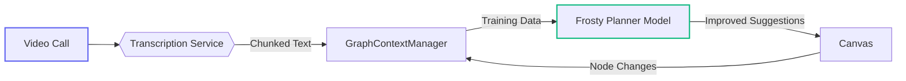

# Distributed Teams & Live Collaboration Strategy (v1.0.0)

> **Status:** Draft – Pending Architecture Review (2025-07-09)  
> *Champion:* Frosty Product Lead

---

## 1. Purpose & Scope
Extends the [Frosty/iceOS Vision](frosty_iceos_vision.md) with capabilities for distributed teams to collaboratively design and refine AI workflows through integrated voice/video and real-time canvas interaction. Creates a closed-loop system where team interactions improve Frosty's reasoning while iceOS ensures governed execution.

---

## 2. Guiding Principles
1. **Telemetry First** – Capture design-time context before building real-time infra
2. **Buy Before Build** – Leverage WebRTC vendors vs. custom media stack
3. **Privacy by Default** – Opt-in data collection with PII redaction
4. **Progressive Enhancement** – Features roll out as opt-in beta modules
5. **Data Flywheel** – Team interactions → training data → improved suggestions

---

## 3. Strategic Rationale
| Market Gap | iceOS Opportunity |
|------------|-------------------|
| Current collab tools lack execution integration | Turn discussions into runnable systems via MCP |
| Team knowledge evaporates post-meeting | Frosty becomes institutional memory via transcript+canvas indexing |
| Multi-modal AI training data scarcity | Create unique voice+graph alignment corpus |

---

## 4. Phased Roadmap
| Phase | Date | Key Deliverables | Exit Criteria |
|-------|------|------------------|---------------|
| **0 · Telemetry Foundation** | Q2-2026 | • `MeetingContext` schema in GraphContextManager<br/>• Zoom/Meet webhook ingestion | 3 design partners live |
| **1 · Media MVP** | Q3-2026 | • LiveKit integration<br/>• Shared cursor+canvas<br/>• Real-time transcript feed | P95 latency ≤200ms |
| **2 · Frosty-in-Call** | Q4-2026 | • Live suggestion panel<br/>• /frosty slash commands<br/>• Auto-draft from transcript peaks | 40% call participation rate |
| **3 · Model Training** | Q1-2027 | • Anonymized data pipeline<br/>• Fine-tuned planning model | 15% blueprint quality lift |
| **4 · Spatial Canvas** | Q2-2027 | • 3D workflow visualization<br/>• VR meeting support | TBD partner demand |

---

## 5. Technical Approach


1. **Context Capture**  
   - Extend `GraphContextManager` with `MeetingContext` object
   - Store transcript chunks with speaker tags + canvas action timestamps

2. **Media Infrastructure**  
   - Phase 1: LiveKit/Daily.co embedded via iframe
   - Phase 3: Custom SFU only if vendor limits hit

3. **Model Pipeline**  
   ```python
   # Pseudo-code training flow
   dataset = AnonymizedTranscriptDataset(
       transcripts=ContextStore.query(type="meeting"),
       graphs=ContextStore.query(type="blueprint")
   )
   trainer = FrostyTrainer(
       base_model="gpt-4o",
       peft_config=LoraConfig()
   )
   trainer.train(dataset)  # Output: frosty-planning-v1
   ```

---

## 6. Risks & Mitigations
| Risk | Likelihood | Impact | Mitigation |
|------|------------|--------|------------|
| Media stack complexity | High | High | Vendor SLA + feature flag |
| Data privacy concerns | Medium | Critical | On-device processing option |
| Low adoption | Medium | Medium | Gamification & template library |
| Model overfit | Low | High | Hybrid GPT-4o + fine-tune ensemble |

---

## 7. Resource Plan
| Phase | Team | Budget | Success Metric |
|-------|------|--------|----------------|
| 0-1 | 1 FE, 1 BE | $180k | 5 teams w/100+ collab sessions |
| 2-3 | +1 ML Eng | $320k | 15% faster blueprint completion |
| 4 | +1 3D Eng | $500k | Partner-funded POC |

---

## 8. Decision Recommendation
Approve Phases 0-1 immediately as they:
1. Build on existing [MCP infrastructure](mcp_strategy.md)
2. Reuse [vector indexing](vector_indexing_strategy.md) for transcript storage
3. Create optional value-add vs core path dependency

Delay Phases 2-4 until:
- Frosty self-reflection proves adoption (Q1 2026 review)
- Media vendor contracts finalized
- $1M ARR achieved in core product

---

> Maintainers: Update quarterly with usage metrics from `GraphContextManager` telemetry.