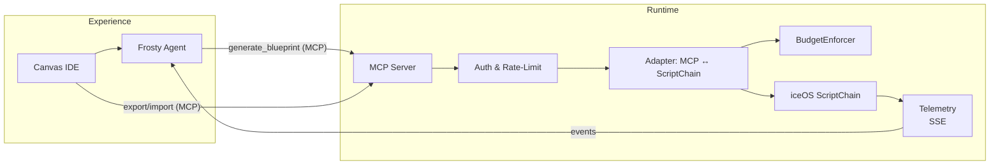

# Frosty & iceOS — Vision and Roadmap (v1.0.0)

> **Status:** Draft – Pending Board Approval (2025-07-09)
> 
> *Champion:* iceOS Lead / Frosty Product Owner

---

## 1. Purpose & Scope

This document clarifies **how Frosty (design intelligence) and iceOS (deterministic execution)** will co-evolve, why we keep them decoupled, and what this means for product strategy and market positioning over the next 24 months.

---

## 2. Guiding Principles

1. **Division of Labor** — Frosty focuses on *ideation & blueprinting*; iceOS owns *runtime, governance & observability*.
2. **Loose Coupling via Standards** — Interaction happens through versioned *Model Context Protocol* (MCP) contracts.
3. **Composable Growth** — Each layer can evolve independently without blocking the other.
4. **Governed Innovation** — New capabilities must respect budget enforcement, safety validators and layering rules.
5. **Ecosystem First** — External partners should be able to extend either layer without forking the core.

---

## 3. Why We *Don’t* Embed iceOS Inside Frosty

| Concern | Outcome if embedded | Outcome with Decoupled Layers |
|---------|--------------------|-------------------------------|
| **Architectural Drift** | Two runtimes to maintain; patch divergence | Single authoritative runtime (iceOS) |
| **Safety & Cost** | Duplication of BudgetEnforcer & validators | One source of truth for guardrails |
| **Velocity** | Frosty team now on-call for runtime outages | Teams focus on their own KPIs |
| **Ecosystem Story** | Harder for partners to swap pieces | Clear interfaces for plugins & vendors |

**Conclusion:** Delegation beats duplication. Frosty invokes iceOS rather than re-implementing it.

---

## 4. Product Visions

### 4.1 Frosty

A *canvas-native AI composer* that:

* Questions users to surface requirements.
* Generates and iterates **ScriptChain blueprints**.
* Highlights cost/latency hot-spots in real time.
* Learns from execution telemetry to improve future drafts (self-reflection).

### 4.2 iceOS

A *deterministic control plane* that:

* Executes blueprints with strict budget & safety policies.
* Streams node-span telemetry (SSE/WebSocket).
* Provides cost, trace and audit artifacts for compliance.

### 4.3 Capabilities & User Value

| Layer  | Core Capabilities | End-User Value |
|--------|------------------|----------------|
| **Frosty (Design)** | • Natural-language → graph conversion • Canvas suggestions & auto-wiring • Real-time cost / latency estimates • Prompt templates & I/O schema generation • Self-reflection on execution traces | • Drastically shorten time-to-prototype • Lower skill barrier—no YAML or Python required • Early warnings on budget overruns or bottlenecks |
| **iceOS (Runtime)** | • Deterministic DAG execution • BudgetEnforcer & safety validators • Scoped/graph context store • Parallelism & retry semantics • Structured telemetry & audit logs | • Production-grade reliability & compliance • Predictable costs, no surprise overruns • Easy debugging and RCA with span-level traces |

### 4.4 Hero User Journey

> *“I want an automated customer-support triage that pulls from Zendesk, classifies urgency, and notifies Slack within 5 minutes.”*

1. **Ideate (Canvas)** – The user drops the requirement in the canvas chat; Frosty proposes a 6-node graph (ZendeskFetcher → Classifier → PriorityRouter → SlackNotifier).  Cost + latency heat-map surfaces a potential bottleneck.
2. **Refine (Frosty)** – The user asks, “Can we batch classify tickets?”; Frosty rewires the graph, adds a BatchNode, and updates latency estimate.
3. **Validate (iceOS dry-run)** – Frosty triggers a `run_blueprint` simulation; iceOS executes with mock data, streaming node-span telemetry back to the canvas.
4. **Deploy (iceOS prod)** – With one click, the blueprint is promoted to prod.  BudgetEnforcer caps daily spend at $5; SSE endpoint streams live metrics.
5. **Iterate (Feedback Loop)** – Frosty inspects real traces, suggests increasing batch size for lower cost, and offers a one-click patch PR.

This journey showcases how Frosty handles **reasoning & graph control** while iceOS guarantees **deterministic, governed execution**.

---

## 5. Combined Stack (2025-2027)

---

## 6. Roadmap

| Phase | Date | Frosty Milestones | iceOS Milestones | Decision Gate |
|-------|------|-------------------|------------------|---------------|
| **0** *Foundations* | Q3-2025 | • Canvas MVP reading existing chains | • SSE telemetry endpoint | PoC demo reviewed |
| **1** *Blueprint Loop* | Q4-2025 | • Frosty generates ScriptChain v1 specs | • run_blueprint MCP endpoint | ≤300 ms P95 latency |
| **2** *Self-Reflection* | Q1-2026 | • Frosty analyses telemetry & proposes optimisations | • Node-span trace API GA | 95 % success on auto-optimise tests |
| **3** *Multi-Agent Templates* | Q2-2026 | • Supervisor & Critic chain templates | • Parallel execution scaling to 1 k nodes | 3 design partners live |
| **4** *Marketplace & SDKs* | H2-2026 | • Plugin SDK for node palette | • Billing & quota GA | $50 k ARR in 6 mo |

*All phases protected by feature flags and **Kill-Switch** criteria.*

---

## 7. Market Evolution Thesis

1. **From Notebooks → Visual IDEs** — Teams will abandon linear Python scripts for drag-and-drop canvases once tooling provides enterprise-grade guardrails.
2. **From Mono-LLM to Multi-Agent** — Complex tasks need orchestrated specialists; deterministic runtimes will outlive ad-hoc “one-prompt” solutions.
3. **From Closed Suites → Composable Stacks** — Winners will expose open contracts (MCP) that let others innovate on top while retaining core IP.

Our architecture aligns with these shifts: Frosty captures design mindshare, iceOS guarantees production reliability.

---

## 8. Risks & Mitigations

| Risk | Mitigation |
|------|------------|
| Spec churn in MCP | Version header; nightly contract tests; N/N-1 support. |
| Team bandwidth | Fixed head-count; scope cut if gates fail. |
| Vendor lock-in pressure | Maintain provider-agnostic SDK & blueprint format. |
| UI/Engine desync | CI diff tests between Canvas export and ScriptChain import. |

---

## 9. Next Steps

* Approve Phase-0 budget and staffing (2 BE, 1 FE, 0.5 SRE).
* Formalise MCP AsyncAPI v0.4 in `docs/api/mcp.yaml`.
* Schedule quarterly architecture council reviews to enforce layering discipline.

> **Tagline:** *Design with Frosty, run with iceOS, evolve with the market.* 