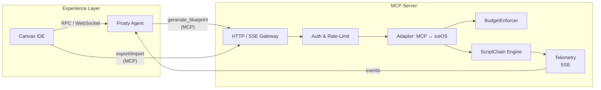

# Model Context Protocol (MCP) — Final Strategy & Roadmap (v1.0.0)

> **Status:** Draft – Pending Board Approval (2025-07-09)  
> *Champion:* iceOS Lead

---

## 1. Guiding Principles

1. **Edge, not Core** – MCP remains a boundary protocol; internal execution keeps using native `ToolService` & `ScriptChain`.  
2. **Product-Led Exposure** – We surface only mature, differentiated capabilities (e.g., Frosty blueprints, runtime telemetry).  
3. **Versioned Contract** – Every response carries `mcp-version`; we support *N* & *N-1* for ≥ 12 months.  
4. **Kill-Switch Gates** – Phases ship behind feature flags with measurable exit criteria (latency, cost, partner uptake).  
5. **Composable, Observable, Metered** – All MCP calls route through BudgetEnforcer, emit OpenTelemetry, and honour per-key quotas.

---

## 2. Why MCP & Why iceOS

| Problem Space | Market Status Quo | iceOS Opportunity via MCP |
|---------------|------------------|---------------------------|
| Accessing best-practice agent workflows | Ad-hoc scripts, brittle notebooks | Serve **validated blueprints** via a standard API |
| Multi-tool orchestration | Vendor-specific SDKs (LangChain, Autogen) | **Neutral runtime kernel** callable by any LLM |
| Visual design portability | No common export format | Canvas → MCP JSON enables shareable, remixable graphs |
| Cost & safety governance | Left to each dev team | BudgetEnforcer + validators exposed as a managed service |

---

## 3. Target Use-Cases

1. **Frosty-as-a-Service** – External agents request blueprint generation (`POST /generate_blueprint`).  
2. **Blueprint Execution** – Clients submit MCP blueprints; iceOS runs them deterministically (`POST /run_blueprint`).  
3. **Canvas Export / Import** – Visual IDE exchanges graphs with remote collaborators through MCP.  
4. **Template Marketplace** *(stretch)* – GET endpoints for curated templates; billing per download.

---

## 4. Reference Architecture

---

## 5. Phase Roadmap & Gates

| Phase | Dates | Key Deliverables | Exit Gate |
|-------|-------|------------------|-----------|
| **0 · Spike & Spec** | **Q4-2025** | • AsyncAPI v0.4 • PoC gateway (localhost) • Contract tests | Spec approved + 50 RPS PoC |
| **1 · Foundation** | **Q1-2026** | • Prod gateway (JWT, SSE) • Redis token-bucket rate-limit • OpenTelemetry traces | P95 latency ≤ 300 ms on 100 RPS |
| **2 · Blueprint Runtime** | **Q2-2026** | • `run_blueprint` endpoint • Streaming node-span events • Billing integration | ≥ 3 design partners live |
| **3 · Frosty Service** | **Q3-2026** | • `generate_blueprint` action • Session-scoped memory adapter • Supervisor chain template | 95 % blueprint validity |
| **4 · Canvas Bridge** | **Q4-2026** | • Canvas import/export • Share links • ACLs | 50 % beta users share via MCP |
| **5 · Marketplace & SDKs** | **Q1-2027** | • Python/TS SDKs (code-gen) • Template marketplace • Stripe metering | \$50 k ARR within 6 mo |

*All phases launch behind feature flags; failure to hit exit gate pauses rollout.*

---

## 6. Build-vs-Buy Matrix

| Component | Build (iceOS) | Buy / OSS | Rationale |
|-----------|---------------|-----------|-----------|
| Gateway + SSE | **FastAPI + httpx** | N/A | Aligns with existing codebase |
| Auth & Quota  | **JWT + Redis** | Auth0 (later) | Low cost, full control |
| Billing       | **BudgetEnforcer + Stripe** | – | Re-use in-house cost calc |
| Client SDK    | **OpenAPI code-gen** | – | Single spec drives all |

---

## 7. Risks & Mitigations

| Risk | Mitigation |
|------|------------|
| Spec volatility | Version header, N/N-1 support, nightly contract tests |
| Traffic spikes  | Redis token-bucket, 429 fallbacks, autoscaling |
| Runaway LLM cost| Pre-execution BudgetEnforcer check + hard caps |
| Layer creep     | Architecture council approval for any cross-layer import |
| Team bandwidth  | Fixed allocation: 2 BE + 0.5 SRE until Foundation GA |

---

## 8. Resource Plan (12 mo)

| Role | Allocation | Cost Estimate |
|------|------------|---------------|
| Backend Eng | 2.0 FTE | \$260 k |
| Frontend Eng | 1.0 FTE (Canvas bridge) | \$120 k |
| SRE/DevOps | 1.0 FTE | \$130 k |
| Product/PM | 0.5 FTE | \$60 k |
| **Total** | – | **\$570 k** (incl. infra) |

---

## 9. Decision Call

**Recommendation:** Approve Phase 0 immediately; fund subsequent phases contingent on gate success.  
This plan positions iceOS as the *neutral control plane* for AI workflows, exposes Frosty’s creativity without runtime duplication, and invites an ecosystem around a stable, versioned protocol.

> “Design with Frosty, execute with iceOS, interoperate via MCP.”

---

> **Maintainers:** Update this doc with every material change and increment the version header.