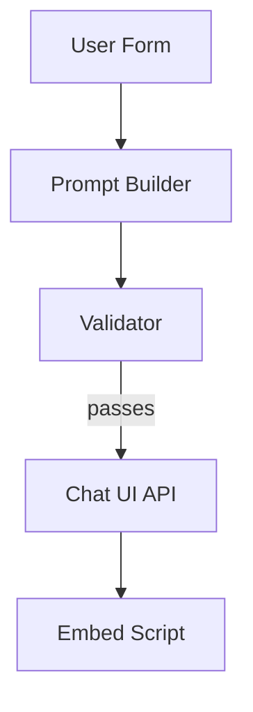

# Chat-in-a-Box Demo

Self-assembling chatbot that deploys to any embeddable chat widget.

## Goal
Given a short questionnaire (tone, KB URL, guardrails), generate a fully-configured chatbot and return the `<script>` snippet that can be dropped into any website.

## High-Level Flow
1. **Prompt Builder Node** – constructs system prompt + sample Q&A pairs.
2. **Validator Node** – runs safety / guardrail checks.
3. **Deployment Tool** – calls external Chat UI service API to create the bot.
4. **Return Snippet** – responds with JavaScript embed code.



## Key Features Demonstrated
- Retrieval-augmented answering (ingest provided KB URL).
- Function-calling pattern for deploying chat config.
- Cost optimiser selects cheapest model that passes validation.
- End-to-end idempotency via `validate()`.

## Running Locally
```bash
# Ensure provider keys are exported
export OPENAI_API_KEY=...
export CHAT_UI_API_KEY=123456   # dummy value fine for local run

# Execute the chain directly
ice run chat_in_a_box.chain.py \
  --input '{
    "tone": "friendly",
    "documents_dir": "./my_manual_files",
    "guardrails": ["no profanity"]
  }'
```

The command returns JSON whose `output.embed_script` contains the `<script>` tag:

```json
{
  "success": true,
  "output": {
    "embed_script": "<script src='https://api.example.com/chatbots/embed/abc123.js'></script>"
  },
  ...
}
```

Paste the snippet into any HTML page to load the chatbot widget.

## Tests
An end-to-end integration test lives at `tests/integration/test_chat_in_a_box_chain.py`. It is marked to *skip* unless `OPENAI_API_KEY` is set, so default CI runs stay offline:

```bash
pytest -k chat_in_a_box --asyncio-mode=auto
```

## TODO
- [ ] Capture cost/latency metrics.
- [ ] Add optional Retrieval Node for KB ingestion.

## Components & Reuse  
*Development Step **2***

| Type | Name | Status |
|------|------|--------|
| Node | **FormIntakeNode** | ⭐ new – transforms questionnaire → config |
| Node | **PromptBuilderNode** | ⭐ new |
| Node | **ValidatorNode** | ✅ reused (`ice_orchestrator.validation`) |
| Node | **RetrievalNode** | ✅ reused from Step 1 KB builder |
| Tool | **ChatUIDeploymentTool** | ⭐ new – REST deploy & returns `<script>` |
| Chain | `chat_in_a_box.chain.toml` | ⭐ new |
| Agent | **ChatbotDeploymentAgent** | ⭐ new (orchestrates nodes) |

Depends on the KB ingestion infrastructure created in Step 1. 

## Knowledge Base Ingestion (new)

```bash
# Ingest your FAQ folder
ice kb ingest docs/support_faq --label support-faq -c 800 -o 120

# or keep watching for new files
ice kb ingest docs/support_faq --watch
```

Add an `EnterpriseKBNode` pulls context automatically.  Update the `watch_dirs` param in the chain or set `CHAT_KB_DIR` env to point elsewhere for quick experiments. 