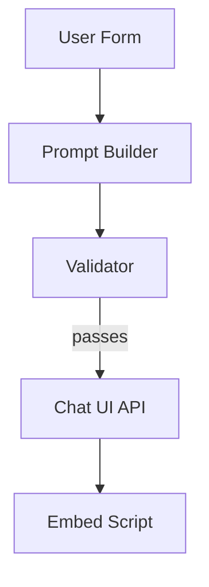

# Chat-in-a-Box Demo

Self-assembling chatbot that deploys to any embeddable chat widget.

## Goal
Given a short questionnaire (tone, KB URL, guardrails), generate a fully-configured chatbot and return the `<script>` snippet that can be dropped into any website.

## High-Level Flow
1. **Form Intake Node** – collects requirements from the user.
2. **Prompt Builder Node** – constructs system prompt + sample Q&A pairs.
3. **Validator Node** – runs safety / hate-speech checks.
4. **Deployment Tool** – calls external Chat UI service API to create the bot.
5. **Return Snippet** – responds with JavaScript embed code.



## Key Features Demonstrated
- Retrieval-augmented answering (ingest provided KB URL).
- Function-calling pattern for deploying chat config.
- Cost optimiser selects cheapest model that passes validation.
- End-to-end idempotency via `validate()`.

## Running Locally
```bash
# Ensure provider keys are exported
export OPENAI_API_KEY=...

# Execute the chain
ice run examples/demo_portfolio/chat_in_a_box/chain.toml
```

## TODO
- [ ] Implement `chain.toml` skeleton.
- [ ] Scaffold `form_intake_node.py`, `prompt_builder_node.py`, `validator_node.py`.
- [ ] Write pytest `@live_llm` integration test.
- [ ] Add cost/latency metrics capture. 

## Components & Reuse  
*Development Step **2***

| Type | Name | Status |
|------|------|--------|
| Node | **FormIntakeNode** | ⭐ new – transforms questionnaire → config |
| Node | **PromptBuilderNode** | ⭐ new |
| Node | **ValidatorNode** | ✅ reused (`ice_orchestrator.validation`) |
| Node | **RetrievalNode** | ✅ reused from Step 1 KB builder |
| Tool | **ChatUIDeploymentTool** | ⭐ new – REST deploy & returns `<script>` |
| Chain | `chat_in_a_box.chain.toml` | ⭐ new |
| Agent | **ChatbotDeploymentAgent** | ⭐ new (orchestrates nodes) |

Depends on the KB ingestion infrastructure created in Step 1. 