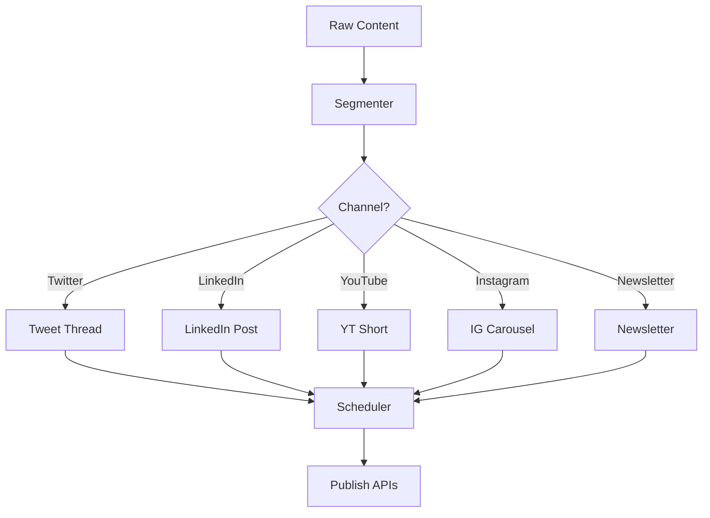

# Content Beast Publisher Demo

Transform one master piece of content into a multi-channel campaign and publish automatically.

## Vision
A single long-form article (blog, podcast transcript, webinar notes) becomes:
- Threadified tweets
- LinkedIn thought-leader post
- YouTube short w/ AI-generated voice-over + slides
- Instagram carousel images
- RSS newsletter entry
All tailored to channel limits, tone, and best-practice hashtags.

## End-to-End Pipeline
1. **Ingest Node** – receives raw markdown / transcript.
2. **Content Segmenter** – splits into logical chunks (intro, key points, CTA).
3. **Channel Adaptation Map** (Condition Executor):
   - **Twitter Branch** → Tweet Thread Generator (280-char slices, emoji optional).
   - **LinkedIn Branch** → Long-form post (max ~3k chars) with professional tone.
   - **YouTube Shorts Branch** → Script ➜ TTS ➜ slides ➜ Upload Tool.
   - **Instagram Branch** → Generates square images via DALL-E + caption writer.
   - **Newsletter Branch** → Markdown → HTML block.
4. **Scheduler Node** – respects optimal posting times per channel.
5. **Publish Tools** – call respective APIs (Twitter/X, LinkedIn v2, YouTube, Meta IG Graph, RSS push).
6. **Metrics Listener** – tracks engagement stats for post-mortem analysis.



## Showcased Features
- Complex branching with `ConditionExecutor` nodes.
- Multi-modal generation (text → image, text → speech → video).
- OAuth-based API tool impls for 5+ platforms.
- Engagement feedback loop via event listeners.
- Budget enforcement across heavy media generation.

## Local Quick-Start (Twitter only)
```bash
export TWITTER_BEARER_TOKEN=...

nice run examples/demo_portfolio/content_beast_publisher/chain.toml --channels twitter
```

## TODO
- [ ] Scaffold `segmenter_node.py` + channel generators.
- [ ] Build Twitter, LinkedIn, IG, YouTube publish tools (stub).
- [ ] Implement scheduler util.
- [ ] Integration test for text-only channels with live LLM. 

## Components & Reuse  
*Development Step **5***

| Type | Name | Status |
|------|------|--------|
| Node | **ContentSegmenterNode** | ✅ reused (from ScriptGenerator / Chunker) |
| Node | **ChannelAdapterNode** | ⭐ new – maps segment → channel format |
| Tool | **TwitterPostTool** | ⭐ new – X / v2 API |
| Tool | **LinkedInPostTool** | ⭐ new – LinkedIn v2 API |
| Tool | **YouTubeShortsTool** | ✅ reused YouTubeUploadTool with diff params |
| Tool | **InstagramPostTool** | ⭐ new – IG Graph API |
| Scheduler | **PostingSchedulerNode** | ⭐ new – optimal time logic |
| Tool | **MetricListenerTool** | ⭐ new – fetch engagement stats |
| Tool | **ChainExecutorTool** | ✅ reused – calls per-channel micro-chain |
| Chain | `content_beast_publisher.chain.toml` | ⭐ new |

Reuses OAuth and media generation tools introduced earlier, adds multi-branch condition structure that future demos can reuse. 