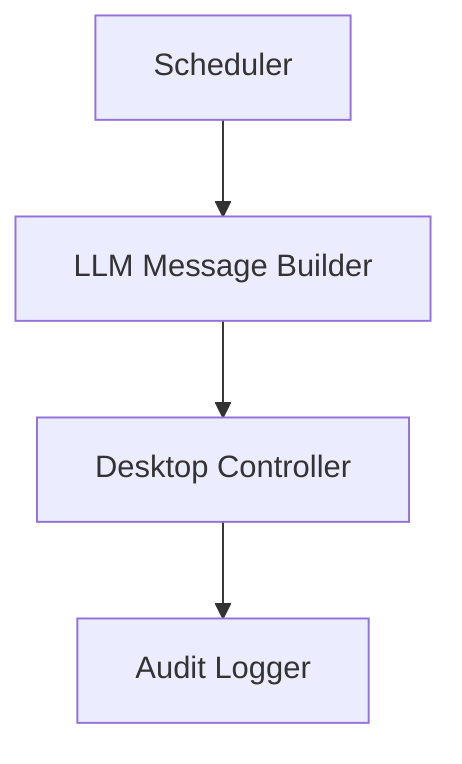

# Desktop Automation Agent Demo

Shows how an iceOS chain can safely control the local desktop via `ComputerTool`.

## Scenario – “Daily Stand-up Slack Poster”
Every weekday at 09:55 the agent:
1. Takes a quick screenshot of the active workspace (for later audit).
2. Opens the Slack desktop app (or browser tab) with a hotkey.
3. Clicks the channel search field, types `#standup`, and presses <Enter>.
4. Types today’s automated stand-up message (pulled from context or LLM).
5. Hits <Enter> to post.

## Pipeline
1. **Scheduler Node** – cron `weekday 09:55`.
2. **Context Builder** – gathers TODO progress → LLM → generates stand-up text.
3. **Desktop Controller** (sequence executor) – calls `ComputerTool` for:
   - `click` at coordinates
   - `type` text
   - `screenshot` before/after (audit)
4. **Audit Logger Tool** – saves screenshots + action log to `~/Desktop/standup_audit/`.



## Security / Opt-In
- Chain TOML must include `allowed_tools = ["computer"]`.
- CLI run requires `--allow-system-tools` flag or environment `ICE_ALLOW_SYSTEM=1`.
- Actions and screenshots are stored locally so users can verify what happened.

## Quick Start (MacOS example)
```bash
pip install pyautogui pillow

# IMPORTANT: give Terminal “Accessibility” permission in System Settings.

nice run examples/demo_portfolio/desktop_automation_agent/chain.toml \
  --allow-system-tools
```

## Demonstrated Features
- System-level automation via `ComputerTool`.
- Cron scheduling within a chain.
- Audit logging of side-effect operations.
- Safety gate that prevents accidental execution without explicit opt-in.

## TODO
- [ ] Scaffold `scheduler_node.py` (cron trigger).
- [ ] Implement `desktop_controller_node.py` that orchestrates ComputerTool calls.
- [ ] Add `audit_logger_tool.py` for screenshots + JSON log.
- [ ] Write stub integration test with `pyautogui` monkey-patch. 

## Components & Reuse  
*Development Step **8***

| Type | Name | Status |
|------|------|--------|
| Node | **SchedulerNode** | ✅ reused (cron) |
| Node | **DesktopControllerNode** | ⭐ new – wraps ComputerTool sequences |
| Tool | **ComputerTool** | ✅ existing system tool |
| Tool | **AuditLoggerTool** | ⭐ new – save screenshot & JSON log |
| Tool | **ChainExecutorTool** | ✅ reused – wraps click/type sequences |
| Chain | `desktop_automation_agent.chain.toml` | ⭐ new |

Relies on bundler & QR code patterns (logging assets) and demonstrates safe local execution. 