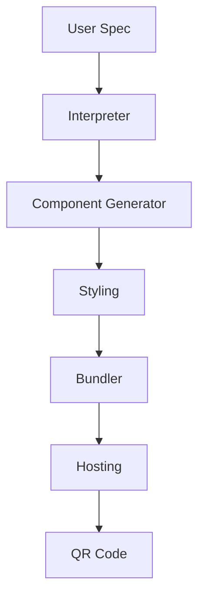

# Dynamic Form Builder Demo

Generate adaptive, embeddable forms (questionnaire / survey / onboarding) with zero front-end coding.

## Goal
Given a YAML/JSON spec (or plain-English prompt), the agent produces:
• React component bundle (ESM) + CSS
• WebComponent wrapper `<ice-form>` for non-React sites
• Optional backend schema (Supabase table or Google Sheets) + webhook URL
• QR code & shareable link

## Pipeline
1. **Spec Interpreter Node** – parses prompt → structured FormSpec Pydantic model.
2. **Component Generator Node** – uses templates to emit React/TSX for each field type.
3. **Styling Node** – tailors CSS theme (choose `light` / `dark` / brand colours).
4. **Bundler Tool** – calls esbuild (via subprocess) → produces single `form.js` asset.
5. **Hosting Tool** – uploads bundle to CDN (e.g., Cloudflare R2) and returns URL.
6. **QR Code Tool** – generates QR PNG linked to hosted form.



## Features Demonstrated
- Code generation (TSX) + build pipeline as part of a chain.
- External subprocess execution under Tool boundary.
- Multi-output artifacts (JS bundle, URL, QR code image).
- Optional database integration with service interface.

## Quick Start
```bash
# Needs esbuild
npm i -g esbuild

nice run examples/demo_portfolio/dynamic_form_builder/chain.toml \
  --prompt "Customer satisfaction survey with NPS and free-text feedback"
```

## TODO
- [ ] Define `FormSpec` Pydantic model.
- [ ] Implement component templates for input, textarea, rating, multi-select.
- [ ] Build `bundler_tool.py` (esbuild wrapper).
- [ ] Write hosting stub for local `./public` folder.
- [ ] Integration test that renders form in headless Chromium. 

## Components & Reuse  
*Development Step **7***

| Type | Name | Status |
|------|------|--------|
| Model | **FormSpec** | ⭐ new – Pydantic schema for form definition |
| Node | **SpecInterpreterNode** | ⭐ new |
| Node | **ComponentGeneratorNode** | ⭐ new – TSX templates |
| Node | **StylingNode** | ⭐ new |
| Tool | **BundlerTool** | ⭐ new – esbuild subprocess |
| Tool | **HostingTool** | ⭐ new – CDN upload |
| Tool | **QRCodeTool** | ⭐ new – generates PNG |
| Chain | `dynamic_form_builder.chain.toml` | ⭐ new |

Establishes the build-pipeline pattern for asset generation that desktop automation agent will later leverage for screenshot PDFs. 