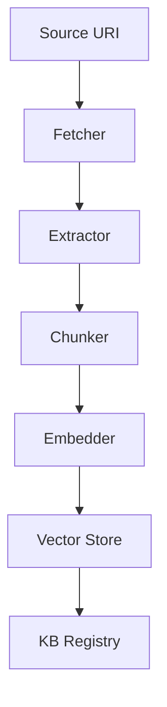

# Knowledge Base Builder & RAG Demo

End-to-end pipeline that ingests heterogeneous content, constructs a searchable knowledge base, and exposes it to downstream chains via the Enterprise KB Node.

## Why This Matters
Many chains (e.g., Chat-in-a-Box, Research Assistant) rely on high-quality retrieval.  This demo shows how to generate that KB once and share it across the platform.

## Supported Sources
- Public webpages (HTML)
- PDF / DOCX uploads
- YouTube video transcripts
- Google Drive files

## Pipeline Stages
1. **Fetcher Node** – downloads raw bytes / HTML.
2. **Text Extractor** – PDFMiner, BeautifulSoup, or YouTube transcript API.
3. **Chunker** – splits into overlap-aware passages.
4. **Embedder Node** – calls provider (`ice_sdk.providers.embedding.hybrid`).
5. **Vector Store Writer** – persists to Chroma / Annoy via service layer.
6. **KB Registry Tool** – registers new collection + metadata.
7. **Validation** – optional PII scrub via regex + heuristics.



## Downstream Usage Example
```toml
# chat_in_a_box/chain.toml
[context]
knowledge_base = "kb://product-docs-2024"
```
At runtime, the Retrieval node automatically injects relevant passages into the prompt.

## Run It Locally
```bash
# Ingest a website and a PDF
nice run examples/demo_portfolio/knowledge_base_builder/chain.toml \
  --sources "https://docs.example.com" \
  --sources "file://~/Downloads/whitepaper.pdf"
```

## Demonstrated Features
- Multi-source ingestion + media-type handlers.
- Vector store abstraction swap (Chroma vs Annoy).
- Reusable KB URI scheme.
- Safety validation prior to persistence.

## TODO
- [ ] Implement Fetcher, Extractor, Chunker nodes with type-hinted Pydantic models.
- [ ] Add PII scrub validator.
- [ ] Integration test measuring recall on a sample corpus. 

## Components & Reuse  
*Development Step **1***

| Type | Name | Status |
|------|------|--------|
| Tool | **FetcherTool** | ⭐ new – HTTP / file fetch w/ retry |
| Node | **TextExtractorNode** | ⭐ new – PDFMiner / BS4 / transcript logic |
| Node | **ChunkerNode** | ⭐ new – overlap-aware splitter |
| Node | **EmbedderNode** | ✅ reused (`ice_sdk.providers.embedding.hybrid`) |
| Tool | **VectorStoreWriterTool** | ⭐ new – abstracts Chroma / Annoy |
| Tool | **KBRegistryTool** | ⭐ new – registers `kb://` URI |
| Validator | **PIIScrubValidator** | ⭐ new |
| Chain | `knowledge_base_builder.chain.toml` | ⭐ new |

These artifacts form the foundation that later demos reuse for retrieval. 