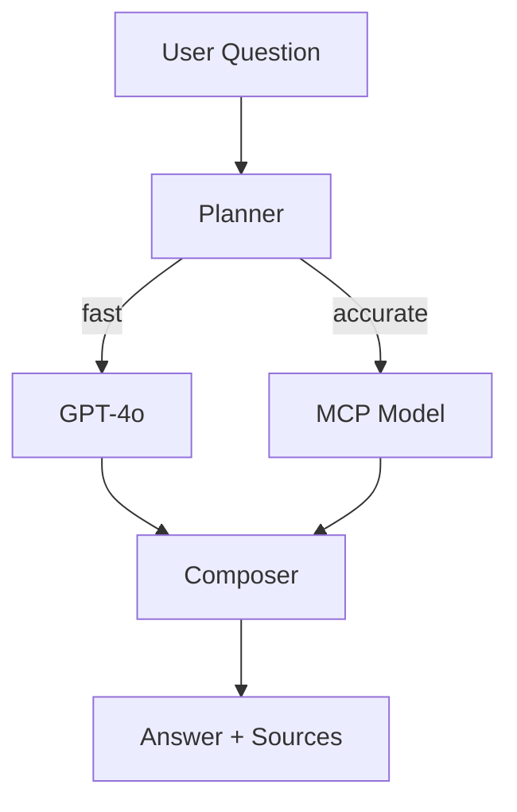

# BYOM Research Assistant Demo (via MCP)

Use any external LLM served over MCP to power deep research Q&A.

## Scenario
User uploads a batch of earnings-call PDFs. The assistant chooses between fast local models and a high-power external model (Together Mistral, etc.) via MCP depending on query complexity.

## Flow
1. **Ingestion Node** – splits & embeds documents.
2. **Query Planner** – analyses question; decides `fast` or `accurate` route.
3. **Fast Path** – uses OpenAI GPT-4o to answer straight from vector store.
4. **Accurate Path** – calls external model through `ice_sdk.tools.protocols.internal_mcp_tool`.
5. **Answer Composer** – merges answer + citations.



## What It Demonstrates
- MCP protocol tooling.
- Dynamic model selection + cost awareness.
- Streaming responses with source attributions.

## Running Locally
Requires an MCP endpoint URL + token.
```bash
export MCP_API_URL=https://api.together.ai
export MCP_API_TOKEN=...

nice run examples/demo_portfolio/research_assistant_mcp/chain.toml
```

## TODO
- [ ] Build `planner_node.py` with model-selection heuristics.
- [ ] Implement MCP tool wrapper.
- [ ] Live LLM test comparing cost & quality metrics. 

## Components & Reuse  
*Development Step **6***

| Type | Name | Status |
|------|------|--------|
| Node | **PlannerNode** | ⭐ new – chooses model route |
| Tool | **MCPInferenceTool** | ⭐ new – generic MCP requester |
| Node | **RetrievalNode** | ✅ reused from Step 1 |
| Node | **AnswerComposerNode** | ✅ reused (summary combinator) |
| Chain | `research_assistant_mcp.chain.toml` | ⭐ new |

Introduces external model pathway; PlannerNode can be reused for smart cost/quality decisions in later enterprise chains. 