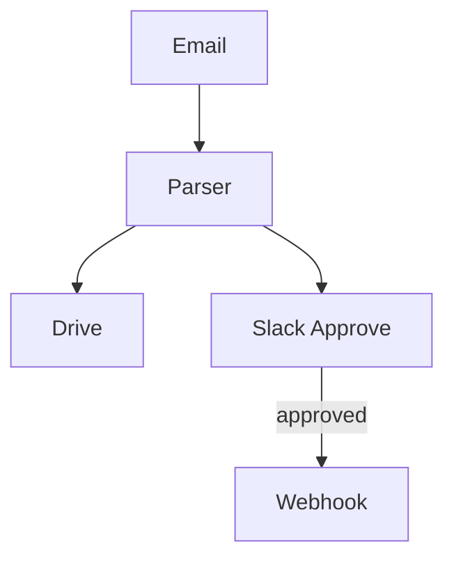

# Inbox → Drive → Slack Workflow Automator Demo

Automates invoice processing from email receipt through Slack approval.

## Use-Case
Small business wants to minimise manual triage of invoices.

## Steps
1. **Gmail Watch Node** – triggers on new email with PDF attachment.
2. **Parser Node** – extracts vendor, amount, due date.
3. **Drive Node** – moves PDF to `Invoices/<year>/` folder.
4. **Slack Poster Tool** – posts an approval thread with buttons.
5. **Condition Executor** – branches on approval outcome.
6. **Webhook Tool** – if approved, hits accounting API.



## Demonstrated Topics
- OAuth token refresh in tool impls.
- Condition executor usage.
- Idempotent retryable design.

## Setup & Run
```bash
export GMAIL_TOKEN=...
export SLACK_BOT_TOKEN=...
export ACCOUNTING_WEBHOOK_URL=...

nice run examples/demo_portfolio/workflow_automator/chain.toml
```

## TODO
- [ ] Build Gmail, Drive, Slack tool wrappers.
- [ ] Define condition branches in chain.
- [ ] Integration tests with SaaS mocks. 

## Components & Reuse  
*Development Step **3***

| Type | Name | Status |
|------|------|--------|
| Tool | **GmailWatchTool** | ⭐ new – OAuth, Gmail API push notifications |
| Node | **EmailParserNode** | ⭐ new – regex/LLM hybrid extraction |
| Tool | **DriveMoveTool** | ⭐ new – Google Drive API wrapper |
| Tool | **SlackPosterTool** | ⭐ new – Slack chat.postMessage w/ blocks |
| Tool | **ChainExecutorTool** | ✅ reused – wraps Gmail→Drive micro-chain |
| Executor | **ConditionExecutor** | ✅ reused (exists in `ice_sdk.executors.condition`) |
| Tool | **WebhookTool** | ✅ reused/generic HTTP POST |
| Chain | `workflow_automator.chain.toml` | ⭐ new |

Reuses scheduling & validation utilities, adds first full OAuth tool set which later demos (e.g., Content Beast) will reuse. 