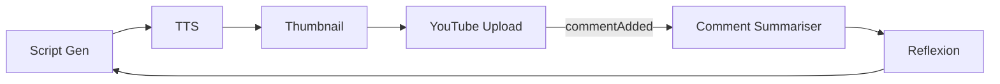

# YouTube Looper Demo

Automate the cycle: script → video → comments → next script.

## Objective
Produce YouTube videos that dynamically respond to audience comments, creating a conversational channel persona.

## Pipeline Overview
1. **Script Generator Node** – writes draft based on topic + last comment summary.
2. **TTS Node** – converts script to MP3 via ElevenLabs.
3. **Thumbnail Node** – generates thumbnail image via DALL-E/Stability.
4. **YouTube Upload Tool** – posts video + thumbnail.
5. **Comment Listener** (event `youtube.commentAdded`).
6. **Comment Summariser** – clusters questions/feedback.
7. **Reflexion Node** – feeds summary into next Script Generator.



## Tech Highlights
- Multi-modal (text→speech, text→image).
- Event-driven reruns.
- Persistent memory for cross-episode context.

## Local Run (single episode)
```bash
export YOUTUBE_API_KEY=...
export ELEVENLABS_API_KEY=...

nice run examples/demo_portfolio/youtube_looper/chain.toml
```

## TODO
- [ ] Scaffold nodes & tools.
- [ ] Implement YouTube event listener.
- [ ] Add integration test with mocked YouTube API. 

## Components & Reuse  
*Development Step **4***

| Type | Name | Status |
|------|------|--------|
| Node | **ScriptGeneratorNode** | ⭐ new – prompt → script |
| Tool | **TTSVoiceTool** | ⭐ new – ElevenLabs / Polly |
| Tool | **ThumbnailImageTool** | ⭐ new – DALL·E / Stability |
| Tool | **YouTubeUploadTool** | ⭐ new – YouTube Data API v3 |
| Tool | **ChainExecutorTool** | ✅ reused – orchestrates script → media micro-chain |
| Node | **CommentSummariserNode** | ⭐ new – clusters comments |
| Listener Tool | **YouTubeCommentListener** | ⭐ new, event source |
| Node | **ReflexionNode** | ✅ reused generic memory-update |
| Chain | `youtube_looper.chain.toml` | ⭐ new |

Inherits OAuth pattern from Step 3 and reuses embedding/summarisation utilities from earlier steps. 