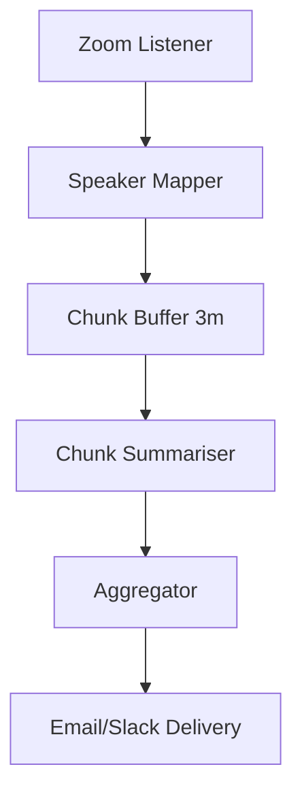

# Zoom Meeting Summarizer Demo

Join a live Zoom meeting, capture the real-time transcript & speaker labels, and deliver an actionable summary with timestamps.

## Capabilities Showcased
- **Realtime Streaming** – consumes Zoom WebSocket transcript feed.
- **Speaker Diarisation** – maps `speaker_id` to participant name.
- **Chunked Summarisation** – windowed LLM summarisation every N minutes.
- **Final Executive Summary** – key decisions, action items, question list.
- **Secure OAuth** – uses Zoom OAuth app; no raw passwords.

## Pipeline Overview
1. **Zoom Listener Tool** – connects to Zoom Meeting SDK, receives transcript JSON.
2. **Speaker Mapper Node** – resolves Zoom `user_id`→display name.
3. **Windowed Buffer** – accumulates 3-min chunks.
4. **LLM Summariser Node** – summarises chunk with timestamp range.
5. **Aggregator Node** – stitches chunk summaries → final report.
6. **Delivery Tool** – emails summary PDF + posts to Slack channel.



## Security & Permissions
- Requires Zoom OAuth app with `meeting:read`, `meeting_transcript:read` scopes.
- Chain TOML must include `allowed_tools = ["zoom_listener", "email_sender", "slack_poster"]`.

## Quick Start (dev sandbox)
```bash
export ZOOM_CLIENT_ID=...
export ZOOM_CLIENT_SECRET=...
export ZOOM_ACCOUNT_ID=...

nice run examples/demo_portfolio/zoom_meeting_summarizer/chain.toml \
  --meeting-id 123456789
```

## Demonstrated Features
- Asynchronous streaming IO inside a Tool.
- Rolling summarisation with low latency.
- Multi-channel delivery of results.

## TODO
- [ ] Implement `zoom_listener_tool.py` (WebSocket client → async iterator).
- [ ] Build `chunk_buffer_node.py` with sliding window logic.
- [ ] Write `chunk_summariser_node.py` using OpenAI function-calling.
- [ ] Aggregator & delivery utilities.
- [ ] Integration test using recorded Zoom transcript JSON. 

## Components & Reuse  
*Development Step **9***

| Type | Name | Status |
|------|------|--------|
| Tool | **ZoomListenerTool** | ⭐ new – WebSocket consumption |
| Node | **SpeakerMapperNode** | ⭐ new |
| Node | **ChunkBufferNode** | ⭐ new – sliding window |
| Node | **LLMSummariserNode** | ✅ reused (from earlier summariser) |
| Node | **AggregatorNode** | ✅ reused |
| Tool | **EmailSenderTool** | ✅ reused generic SMTP/sendgrid |
| Tool | **SlackPosterTool** | ✅ reused Step 3 |
| Tool | **ChainExecutorTool** | ✅ reused – optional post-processing micro-chain |
| Chain | `zoom_meeting_summarizer.chain.toml` | ⭐ new |

Leverages streaming patterns, OAuth, and summarisation components built in previous steps to round out the portfolio. 