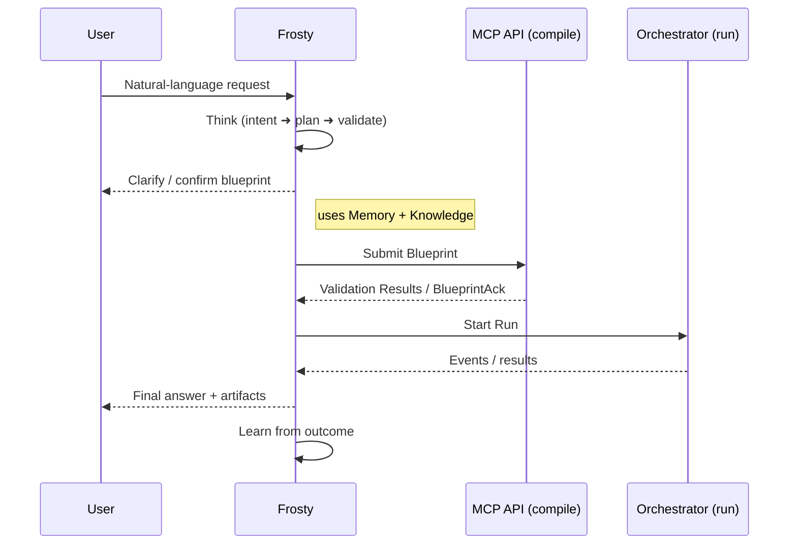

# ❄️ Frosty Architecture (Unified Design)

## 0. Executive Summary
Frosty is the **intelligent front-end for iceOS**.  It turns natural-language requests into validated, optimized DAGs and executes them safely through iceOS.  Frosty works in **four synergistic layers**:

1. **Chat-First Wrapper (UX)** – Conversational interface (chat & slash-commands).  
2. **Cognitive Core** – Thought engine, memory, knowledge, and learning.  
3. **MCP Integration** – Dual-mode **server** (today) + **client** (new) so Frosty can both expose and consume MCP services.  
4. **Orchestrator Runtime** – iceOS’s battle-tested DAG executor.  
*Visual canvas & sketch recognition arrive in **Phase 3+** (see Roadmap).*

```
User ↔ Frosty (UX  ✚  Cognition) ↔ MCP API (compile) ↔ Orchestrator (run)
```

---

## 1. Layered Architecture
### 1.1 Cursor-Style Wrapper
Frosty behaves like the Cursor editor: a chat thread + code lens that
• understands code and docs, 
• lets users issue `@frosty` commands, and  
• offers a visual canvas for live blueprint editing.

### 1.2 Cognitive Core
```
┌───────────────┐    ┌──────────────┐    ┌───────────────┐
│  Thought      │    │  Memory      │    │ Knowledge     │
│  Engine       │    │  (STM/LTM)   │    │  Base         │
└─────┬─────────┘    └────┬─────────┘    └────┬──────────┘
      │                   │                   │
      └─────────► Blueprint Generation ◄──────┘
```
• **Intent Parser → Reasoner → Planner → Validator**  
• Short-term memory keeps the conversation; long-term stores patterns, prefs, and outcomes.  
• Knowledge base tracks tools, patterns, and examples.  
• Learning system continuously improves tool selection and plan quality.

### 1.3 MCP Integration (Dual-Mode)
| Mode | Purpose | Key Pieces |
|------|---------|------------|
| **Server** | Expose iceOS tools/agents/workflows via JSON-RPC 2.0 | Existing `ice_api/api/mcp_*` |
| **Client** | Connect to *external* MCP servers (GitHub, Datadog, Linear…) | `MCPClientManager` · `MCPClientTool` · `MCPDiscoveryAgent` |

### 1.4 Orchestrator Runtime
Validated blueprints become DAGs executed by iceOS with retries, budgets, tracing, and event streaming.

---

## 2. Key Components & APIs
### 2.1 Intelligence Router
Decides whether a request is:
* Simple Q&A (handled directly by an LLM)
* Needs a specialist agent
* Requires a new / updated blueprint

### 2.2 Blueprint Generation Engine
1. **Parse** – translate *text* intent into node skeletons (*Sketch support → Phase 3*).  
2. **Refine** – interactively fill config, add control flow.  
3. **Optimize** – apply cost / governance / best-practice rules.  
4. **Emit** – produce `Blueprint` or `PartialBlueprint` for MCP API.

### 2.3 MCP Client Sub-system
* `MCPClientManager` – async connection pool, auth, capability cache.  
* `MCPServerRegistry` – YAML/ENV driven list of known servers.  
* `MCPClientTool` – makes MCP calls inside DAGs.  
* `MCPDiscoveryAgent` – suggests servers & tools based on user intent.

### 2.4 Memory & Learning
* **STM**: conversation history, current blueprint draft.  
* **LTM**: user patterns, workflow outcomes, optimization rules.  
* **Episodic**: notable interactions for replay.  
* **Semantic**: concept graph linking domains ↔ tools.  
* **Learning Loop**: post-run analytics feed back into LTM + optimization rules.

---

## 2.5 Cognitive Stack – Frosty’s Brain
Inspired by neuroscience, cognitive science, ML systems engineering, and first-principle philosophy, Frosty’s cognition is an **iterative, modular, hierarchical** engine that turns ambiguous goals into validated, executable blueprints.

### 2.5.1 Core Subsystems
| Layer | Responsibility | Key Techniques |
|-------|----------------|----------------|
| **Perception** | Ingest user messages, tool/runtime feedback | LLM embedding, schema extraction, sentiment & certainty scoring |
| **Working Memory (STM)** | Holds current conversation, partial blueprint, open questions | Context window management, frame stacking |
| **Long-Term Memory (LTM)** | Episodic, semantic, procedural stores exposed by `UnifiedMemory` | Vector search, graph traversal, retrieval-augmented generation |
| **Reasoner** | Deductive & abductive inference; decomposes goals | Tree-of-Thought, POI* (Plan-Observe-Iterate) loop |
| **Planner** | Builds hierarchical task graph → atomic nodes | Iterative deepening search, constraint satisfaction |
| **Tool Synthesizer** | Generates or adapts code for new Tools | GPT-4 codegen ⇒ `ToolScaffold`, mypy --strict pass, unit scaffolding |
| **Validator** | Calls MCP compile tier; checks budget, schema, policy | Auto-fix suggestions, diff generation |
| **Dialogue Manager** | Chooses next user interaction (clarify/confirm/show draft) | Information gain maximization, cooperative principle |
| **Learning Loop** | Stores outcomes, updates heuristics & prompt exemplars | Reinforcement learning on blueprint quality & cost metrics |

*POI = Frosty’s variation of OODA: Plan, Observe, Iterate until confidence ≥ threshold.*

### 2.5.2 Memory Mode Utilization
| Memory Type | Purpose in Cognition | Example |
|-------------|---------------------|---------|
| **Working** | Conversation tokens, current draft; TTL < 30 min | “We still need the API key for HubSpot” |
| **Episodic** | Past sessions for this user | Recall last week’s failed Slack auth attempt |
| **Semantic** | Knowledge graph of domains ↔ tools ↔ patterns | “`csv_reader` emits `dataframe`, compatible with `summarizer`” |
| **Procedural** | Learned workflow optimisation rules | “If cost > $1 and provider=openai, suggest Claude-Sonnet” |

All queries go through `UnifiedMemory.query(type=…, q=…)` ensuring layer purity (Rule 5).

### 2.5.3 Hierarchical Decomposition Algorithm
```
function decompose(goal):
    if goal fits atomic node → return [Node(goal)]
    sub_goals = draft_plan(goal)          # Reasoner L1
    for g in sub_goals:
        tasks += decompose(g)             # Depth-first refinement
    return tasks
```
* Guarantees termination: recursion depth ≤ 4 (workflow → chain → node → tool).* 
* Stops when atomic Node exists or Tool synthesis queued.*

### 2.5.4 Tool Synthesis Flow
1. **Trigger** – Decomposition finds capability gap.
2. **Spec Draft** – Reasoner writes JSON spec (name, inputs, outputs, side-effects).
3. **Code Gen** – Tool Synthesizer calls GPT-4 Code w/ internal templates.
4. **Static Checks** – mypy --strict, ruff, tests skeleton pass locally.
5. **Registry Publish** – `ToolRegistry.register()` adds to catalog.
6. **User Review** – Diff shown; user may edit or approve.

### 2.5.5 Interactive Workflow Cycle
```
USER → (message)
  ↓
Perception → Reasoner → Planner
  ↓ clarify_needed? ───── yes ──▶ DialogueMgr → ask USER
  │ no
  ↓
Plan chunk ready? ──▶ Validator → MCP compile
  │ success                              │ failure
  ↓                                      ↓
Emit blueprint chunk            fix → Reasoner
  ↓
Execute via Orchestrator (if run requested)
  ↓
Observe results → Learning Loop → Memory
  ↺ (iterates until goal satisfied)
```
*Frosty always submits **smallest self-contained plan fragments** for validation to keep the user engaged and catch errors early.*

### 2.5.6 Cognitive Guard-Rails
* **Cost-Aware Reasoning** – Planner penalises expensive branches.
* **Uncertainty Thresholds** – If confidence < 0.6, always clarify.
* **Policy Checks First** – Before code gen, run spec through policy linter to avoid disallowed domains.
* **Reflection Step** – After each cycle, Reasoner executes a brief self-critique (“What could fail next?”).

---

## 3. End-to-End Flow


### 3.1 Example User Story – Jenna at FintechCo

> “I used to spend hours switching tabs between Datadog, GitHub and Slack.  
> Now I just ask Frosty and it does everything while I’m sipping coffee.”

**Scenario** – Payment API latency spike in US-East

| Step | Actor | Action |
|------|-------|--------|
| 1 | Datadog MCP | Emits `latency_alert` event |
| 2 | Frosty (MCP client) | Receives webhook → intent = “investigate incident” |
| 3 | Cognitive Core | Plans workflow: fetch metrics → correlate deploy → analyse slow queries → patch code → notify team |
| 4 | Blueprint Engine | Generates 7-node DAG (2 MCP nodes, 3 agents, 2 tools) |
| 5 | MCP API | Validates, estimates cost ≈ $0.18, passes governance checks |
| 6 | Orchestrator | Executes: ← Datadog, GitHub, NeonDB, Slack MCP calls; agents generate fix & PR |
| 7 | Frosty | Streams progress to user; asks “merge PR?” – Jenna replies “yes” |
| 8 | Orchestrator | Merges PR, runs CI, posts Slack summary |
| 9 | Learning Loop | Stores outcome; raises confidence for “index-missing” pattern |

**Generated Blueprint (abridged)**
```yaml
blueprint_id: payment_incident_response
nodes:
  - id: alert_source          # MCP (datadog.get_metric)
  - id: correlate_deploy      # Agent (incident_investigator)
  - id: slow_query_analyser   # MCP (neon.analyse_query)
  - id: generate_fix          # Agent (code_fixer)
  - id: create_pr             # MCP (github.create_pr)
  - id: slack_summary         # MCP (slack.post_message)
  - id: postmortem_generator  # Agent (doc_generator)
```

This walk-through demonstrates all layers:
* **Cursor UX** – Jenna chats in plain English.
* **Cognitive Core** – understands intent, plans workflow, interacts for approval.
* **MCP Client** – pulls data & performs actions across external services.
* **MCP Server / Orchestrator** – validates and runs the DAG with guarantees.
* **Learning** – stores the incident-response pattern for faster future remediation.

---

## 4. Implementation Roadmap
### Phase 1 – MCP Client Foundation *(Week 1)*
* `MCPConnection` (stdio + HTTP) & JSON-RPC client
* `MCPClientManager` w/ auth + retry + health-check
* Unit + integration tests with sample MCP servers

### Phase 2 – Cursor Wrapper & Basic Cognition *(Weeks 2-3)*
* Chat UI integration
* Intelligence Router MVP (LLM routing)
* Blueprint Generation Engine v0 (single-node, instant blueprints)
* Register `MCPClientTool` in registry

### Phase 3 – Advanced Cognition & Learning *(Weeks 4-6)*
* Full memory subsystem (STM + LTM)  
* Multi-node planning, control flow, cost estimation  
* MCPDiscoveryAgent + server suggestions  
* Learning loop + metrics dashboard

### Phase 4 – Canvas & Partial Blueprints *(Week 7+)*
* Visual editing with real-time `PartialBlueprint` validation  
* Drag-and-drop MCP nodes  
* Predictive suggestions & governance warnings

---

## 5. Success Metrics
| Area | Target |
|------|--------|
| Intent recognition | ≥ 95 % accuracy |
| Blueprint acceptance | ≤ 2 iterations avg |
| Execution success | ≥ 97 % runs pass |
| External MCP latency | ≤ 500 ms avg/tool call |
| User NPS | ≥ 45 |

---

## 6. Security & Governance
* All external MCP calls use least-privilege scoped tokens.  
* Budget & PII checks enforced in MCP compile tier.  
* Audit log for every MCP request + DAG execution.

---

## 7. Future Enhancements
* Multi-modal inputs (images / diagrams).  
* Collaborative knowledge sharing across Frosty instances.  
* Predictive, proactive blueprint creation.

---

> Frosty unifies conversational intelligence, rigorous validation, and powerful execution—turning ideas into safe, optimized, and auditable workflows across the entire MCP ecosystem. 