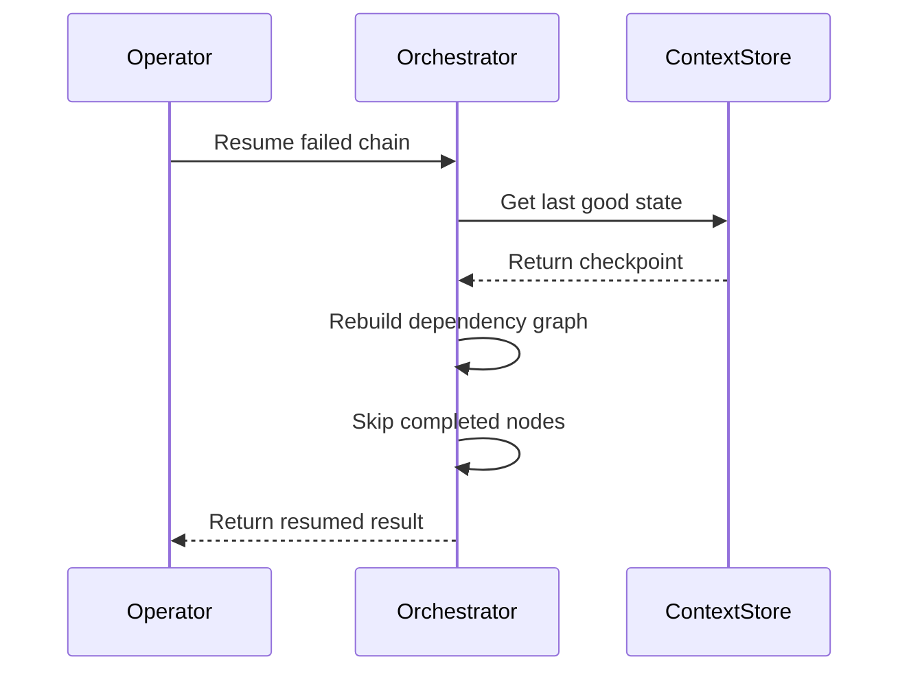

# ice_orchestrator – API Guide

## Execution Phases

| Phase | Method | Description |
|-------|--------|-------------|
| 1. Dry-run Validation | `ScriptChain.validate_chain()` | Static checks – schema alignment, license & compliance gates |
| 2. Context Hydration  | internal | Pre-execution loading of external resources |
| 3. Dependency Resolution | `DependencyGraph` | Topological sort + level assignment |
| 4. Node Execution | `ScriptChain.execute()` | Level-based async execution with retry & back-off |
| 5. State Finalization | `WorkflowExecutionContext.persist_state()` | Flush context & emit telemetry |

## Error Recovery Flow



## Public Classes

### `ScriptChain`
* `execute()` – Run the chain and return `ChainExecutionResult`.
* `validate_chain()` – Perform static checks, returns list[str] errors.

### `WorkflowExecutionContext`
* `persist_state(key, state)` – Batch-persist execution state.

### `DependencyGraph`
* `get_level_nodes()` – Mapping int→List[str] of execution levels.
* `validate_schema_alignment(nodes)` – Ensure input/output contract integrity.

## CLI Integration

Expose the orchestrator via **Ice CLI**:

```bash
ice-cli chain run --file my_chain.yaml --input '{"name": "Mia"}'
```

## Extending

1. **Custom Nodes** – Implement `BaseNode` and register with `ice_sdk.node_registry`.
2. **Stores** – Provide an async class with `bulk_save()` for persistence.
3. **Metrics** – Hook into `ice_sdk.utils.perf` for custom timing.

---
> For additional details see the full developer docs under `docs/architecture`. 