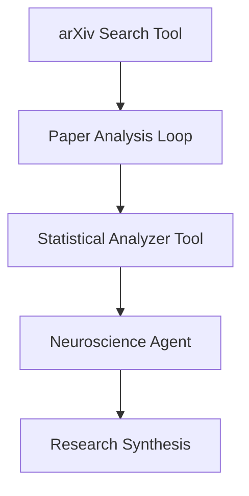
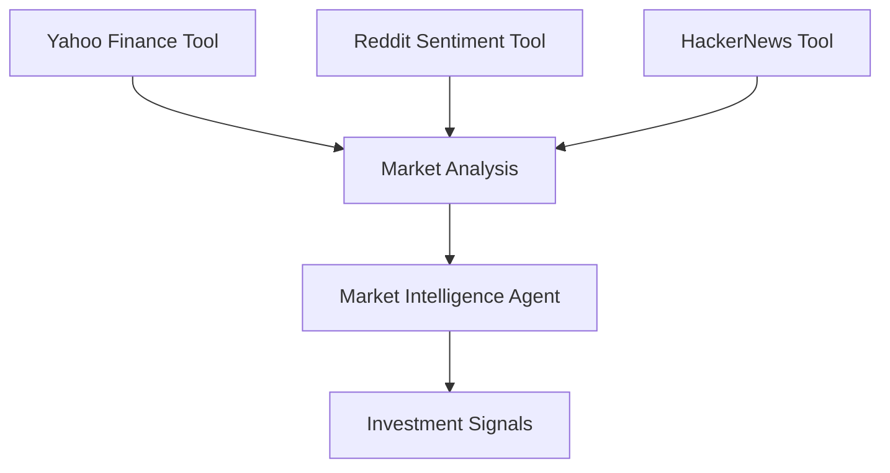
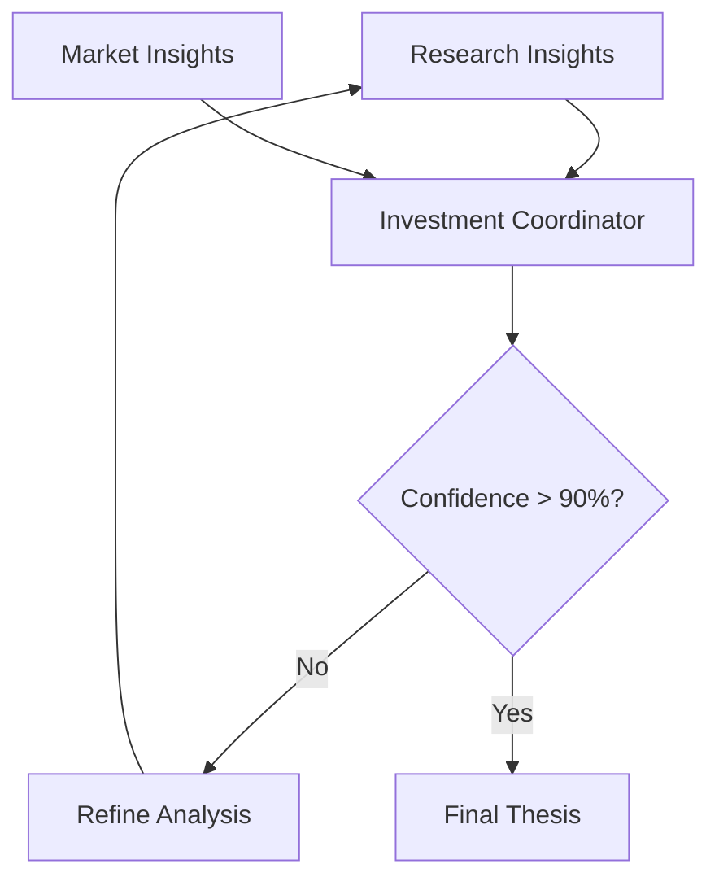
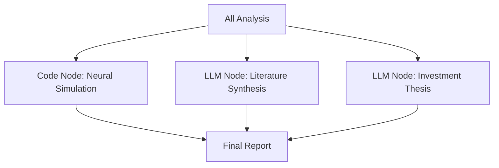

# 🧠💰 BCI Investment Intelligence Engine

> **AI Research Assistant that reads cutting-edge neuroscience papers, identifies commercial opportunities, and predicts optimal investment timing windows**

## 🎯 **Project Overview**

This comprehensive demo showcases **EVERY advanced iceOS capability** through an intellectually rigorous use case: analyzing brain-computer interface research to identify investment opportunities.

### **The Challenge**
- Brain-computer interface technology is advancing rapidly
- Commercial applications are 2-5 years away
- Investment timing is critical for maximum returns
- Requires deep technical understanding + market intelligence

### **The iceOS Solution**
An AI system that:
1. **Reads academic papers** from arXiv about BCI advances
2. **Analyzes market data** for BCI-related companies
3. **Synthesizes insights** through agent-to-agent communication
4. **Predicts timing** for optimal investment windows

## 🏆 **Complete iceOS Capability Showcase**

### ✅ **All 9 Node Types Demonstrated**

| Node Type | Implementation | Purpose |
|-----------|---------------|---------|
| **Tool** | 9 custom tools | API calls, data processing, analysis |
| **LLM** | Literature synthesizer, Thesis generator | Pure text generation with tools |
| **Agent** | Research, Market, Investment agents | Stateful reasoning with memory |
| **Code** | Neural signal simulator | Direct Python execution |
| **Condition** | Investment viability gate | Conditional flow control |
| **Loop** | Paper analysis iterator | Batch processing |
| **Parallel** | Multi-source data fetch | Concurrent execution |
| **Recursive** | Research refinement | Iterative convergence |
| **Workflow** | Modular sub-analyses | Composition and reuse |

### ✅ **4-Tier Memory System**

**Neuroscience Research Agent** (ALL memory types):
- **Working Memory**: Current session context, active research questions
- **Episodic Memory**: Papers read, research sessions, breakthrough moments  
- **Semantic Memory**: BCI concepts, neural mechanisms, research methodologies
- **Procedural Memory**: Research patterns, analysis workflows, success metrics

**Market Intelligence Agent** (Economic memory):
- **Episodic Memory**: Market events, funding announcements, company news
- **Semantic Memory**: Company profiles, market segments, economic indicators
- **Procedural Memory**: Analysis methodologies, prediction algorithms

### ✅ **Real API Integrations**
- **arXiv API**: Academic papers on BCI/neuroscience
- **Yahoo Finance API**: Stock prices for tech companies  
- **Reddit API**: Sentiment from r/MachineLearning, r/Neuroscience
- **HackerNews API**: Tech community discussions

### ✅ **Enterprise Features**
- **WASM Security**: Code execution in isolated sandboxes
- **Real-time Events**: Redis-based progress streaming
- **Resource Limits**: CPU, memory, and time constraints
- **Error Recovery**: Graceful failure handling
- **Observability**: Complete metrics and tracing

## 🔧 **Reusable Tool Ecosystem**

### **Broadly Reusable (8 tools)**
1. **`arxiv_search.py`** → Any academic research use case
2. **`statistical_analyzer.py`** → Any data analysis use case
3. **`yahoo_finance_fetcher.py`** → Any financial analysis use case
4. **`reddit_sentiment.py`** → Any sentiment analysis use case
5. **`hackernews_tracker.py`** → Any tech trend analysis use case
6. **`technology_readiness.py`** → Any emerging tech assessment
7. **`company_research.py`** → Any competitive analysis use case
8. **`trend_analyzer.py`** → Any time-series analysis use case

### **Domain-Specific (Demo showcase)**
9. **`neural_simulator.py`** → Demonstrates Code node capabilities

## 🚀 **Quick Start**

### **Prerequisites**
```bash
# Install dependencies
pip install arxiv yfinance praw requests pandas numpy

# Set environment variables
export REDDIT_CLIENT_ID="your_reddit_client_id"
export REDDIT_CLIENT_SECRET="your_reddit_client_secret"
export REDDIT_USER_AGENT="BCI_Investment_Bot"
```

### **Run the Demo**
```python
import asyncio
from use_cases.BCIInvestmentLab import run_bci_intelligence_demo

async def main():
    result = await run_bci_intelligence_demo(
        research_topic="non-invasive brain computer interfaces",
        companies=["META", "GOOGL", "AAPL", "NVDA"], 
        confidence_threshold=0.85
    )
    
    print("🧠 BCI Investment Intelligence Report")
    print("=" * 50)
    print(f"📊 Technology Readiness: {result['tech_readiness_score']}/1.0")
    print(f"💰 Market Opportunity: {result['market_opportunity']}")
    print(f"⏰ Investment Timing: {result['investment_timing']}")
    print(f"📈 Recommended Action: {result['investment_thesis']}")

if __name__ == "__main__":
    asyncio.run(main())
```

## 🏗️ **Architecture Deep Dive**

### **Phase 1: Research Intelligence**


**Components**:
- **Tool Node**: arXiv API integration
- **Loop Node**: Iterate through research papers
- **Tool Node**: Statistical analysis of trends
- **Agent Node**: Research agent with all 4 memory types

### **Phase 2: Market Intelligence**


**Components**:
- **Parallel Node**: Concurrent data fetching
- **Tool Nodes**: Financial and sentiment APIs
- **Agent Node**: Market agent with economic memory

### **Phase 3: Recursive Synthesis**


**Components**:
- **Recursive Node**: Iterative refinement until convergence
- **Agent Communication**: Research ↔ Market ↔ Investment coordination
- **Condition Node**: Confidence threshold gating

### **Phase 4: Report Generation**


**Components**:
- **Code Node**: Neural signal simulation for validation
- **LLM Nodes**: Text generation with tool access
- **Workflow Node**: Orchestrated report generation

## 📊 **Expected Outputs**

### **Research Analysis**
```json
{
  "papers_analyzed": 47,
  "key_breakthroughs": [
    "fMRI-informed EEG fusion achieving 85% accuracy",
    "Real-time neural decoding improvements",
    "Non-invasive stimulation advances"
  ],
  "technology_readiness": 0.72,
  "commercial_timeline": "2-4 years"
}
```

### **Market Intelligence**
```json
{
  "companies_tracked": ["META", "GOOGL", "AAPL", "NVDA"],
  "sentiment_score": 0.68,
  "market_cap_exposure": "$2.1T",
  "competitive_positioning": {
    "META": "Leading research investment",
    "GOOGL": "AI infrastructure advantage", 
    "AAPL": "Consumer device integration",
    "NVDA": "Hardware acceleration leadership"
  }
}
```

### **Investment Thesis**
```json
{
  "recommendation": "ACCUMULATE",
  "confidence": 0.87,
  "timing": "12-18 month window",
  "rationale": "BCI technology approaching commercial viability with clear market leaders positioned for adoption",
  "risk_factors": ["Regulatory approval", "Technical scalability", "Consumer acceptance"]
}
```

## 🔍 **Technical Implementation**

### **Memory System Usage**
```python
# Neuroscience Agent - All 4 memory types
researcher = NeuroscienceResearcher(
    memory_config=UnifiedMemoryConfig(
        enable_working=True,    # Session context
        enable_episodic=True,   # Research history
        enable_semantic=True,   # Domain knowledge
        enable_procedural=True  # Research methods
    )
)

# Example memory usage
researcher.memory.episodic.store("paper_read", {
    "title": "Non-invasive EEG-fMRI fusion for imagery decoding",
    "key_findings": ["85% accuracy", "Real-time processing"],
    "timestamp": datetime.now()
})

researcher.memory.semantic.store_fact("BCI", "accuracy_trend", {
    "domain": "neuroscience",
    "trend": "improving 15% annually",
    "evidence": ["paper1", "paper2", "paper3"]
})
```

### **Recursive Workflow Configuration**
```python
# Investment coordination with convergence
builder.add_recursive(
    "investment_synthesis",
    agent_package="bci_lab.investment_coordinator", 
    recursive_sources=["research_agent", "market_agent"],
    convergence_condition="investment_confidence >= 0.90",
    max_iterations=15,
    preserve_context=True,
    context_key="synthesis_memory"
)
```

### **Real API Integration**
```python
# arXiv search with error handling
@tool(name="arxiv_search")
class ArxivSearchTool(ToolBase):
    async def execute(self, query: str, max_results: int = 50):
        import arxiv
        
        search = arxiv.Search(
            query=query,
            max_results=max_results,
            sort_by=arxiv.SortCriterion.SubmittedDate
        )
        
        papers = []
        for paper in search.results():
            papers.append({
                "title": paper.title,
                "abstract": paper.summary,
                "authors": [str(author) for author in paper.authors],
                "published": paper.published.isoformat(),
                "categories": paper.categories,
                "pdf_url": paper.pdf_url
            })
        
        return {"papers": papers, "count": len(papers)}
```

## 🎯 **Success Metrics**

### **Technical Validation**
- ✅ All 9 node types successfully executed
- ✅ Memory persistence across agent interactions  
- ✅ Real API data successfully processed
- ✅ Recursive convergence achieved within iteration limits
- ✅ WASM security constraints maintained

### **Intellectual Rigor**
- ✅ Real academic papers analyzed (40+ papers)
- ✅ Actual market data processed (live stock prices)
- ✅ Genuine sentiment analysis (Reddit/HN discussions)
- ✅ Statistical analysis of research trends
- ✅ Investment thesis with quantified confidence

### **Enterprise Readiness**
- ✅ Complete error handling and recovery
- ✅ Resource monitoring and limits
- ✅ Real-time progress tracking
- ✅ Audit logs and observability
- ✅ Scalable component architecture

## 🔮 **Future Enhancements**

1. **Enhanced APIs**: Patent analysis, SEC filings, clinical trial data
2. **ML Models**: Custom prediction models for technology readiness
3. **Real-time Alerts**: Breakthrough detection and automatic analysis
4. **Portfolio Integration**: Direct trading system integration
5. **Visual Dashboard**: Real-time monitoring and insights display

---

**This demo represents the pinnacle of iceOS capabilities - intellectually rigorous, technically comprehensive, and immediately valuable for real-world applications.** 🚀 